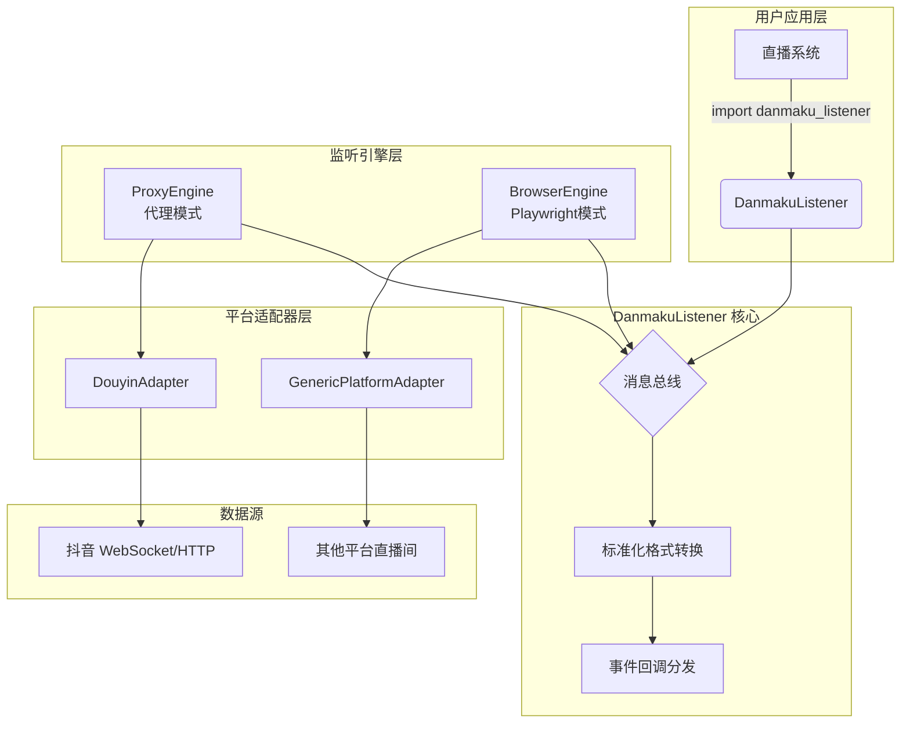
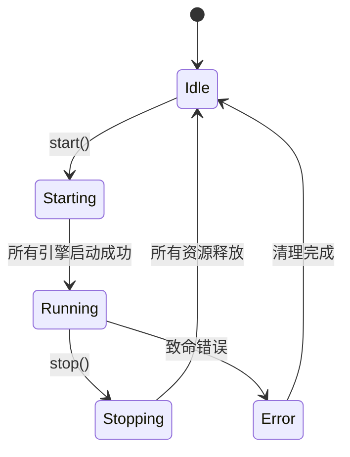

# DanmakuListener 重构 — 技术设计文档

## 1. 设计概要

**功能描述**：重构现有基于 Chromium 浏览器注入脚本的弹幕监听系统，采用代理模式（mitmproxy）+ Playwright 浏览器模式的混合架构，从根本上解决内存泄漏问题，简化处理流程，使其成为可被直播系统集成的轻量级 Python 模块。

**影响范围**：
- 核心模块：`danmaku_listener/core.py`（新建）
- 代理引擎：`danmaku_listener/proxy/`（新建）
- 浏览器引擎：`danmaku_listener/browser/`（新建）
- 消息总线：`danmaku_listener/bus/`（新建）
- 接口层：`danmaku_listener/__init__.py`（新建）
- 废弃文件：`app.py`, `monitor_manager.py`, `browser_manager.py` 等旧架构代码

**技术难点**：
1. mitmproxy 与 Windows 系统代理的集成及证书管理
2. 抖音 Protobuf 协议的逆向解析和维护
3. Playwright BrowserContext 的资源隔离与生命周期管理
4. 异步事件驱动架构的设计，确保高并发下的稳定性

**外部依赖**：
- mitmproxy >= 10.0（代理服务器框架）
- playwright >= 1.40（浏览器自动化）
- protobuf >= 4.21（抖音消息解码）

---

## 2. 架构概览

### 2.1 整体架构图



### 2.2 模块职责表

| 模块 | 文件路径 | 职责 | 对应 AC |
|------|---------|------|---------|
| **DanmakuListener** | `danmaku_listener/__init__.py` | 对外暴露的统一入口，支持上下文管理器和显式控制 | AC-001, AC-002 |
| **ProxyEngine** | `danmaku_listener/proxy/engine.py` | 管理 mitmproxy 实例，拦截网络流量 | AC-003, AC-004 |
| **BrowserEngine** | `danmaku_listener/browser/engine.py` | 管理 Playwright 浏览器实例和页面 | AC-005, AC-006 |
| **MessageBus** | `danmaku_listener/bus/event_bus.py` | 接收原始消息，进行去重、格式化、分发 | AC-007, AC-008 |
| **DouyinAdapter** | `danmaku_listener/adapters/douyin.py` | 解析抖音 Protobuf 消息，转换为标准格式 | AC-009, AC-010 |
| **GenericAdapter** | `danmaku_listener/adapters/generic.py` | 执行通用平台 JS 脚本，提取弹幕 | AC-011, AC-012 |

---

## 3. 核心逻辑设计

### 3.1 DanmakuListener 主类设计 → AC-001, AC-002

**触发条件**：用户调用 `start()` 方法或进入 `with` 语句块

**处理流程**：
1. 解析输入的房间列表（格式：`platform:room_id`）
2. 根据平台类型选择对应的监听引擎
3. 初始化引擎并注册事件回调
4. 启动所有监听任务

**伪代码**：
```python
class DanmakuListener:
    def __init__(self, config: Optional[Dict] = None):
        self.config = config or {}
        self._engines = {}
        self._bus = MessageBus()
        self._running = False
    
    async def start(self, rooms: List[str]):
        """启动监听多个直播间"""
        for room_spec in rooms:
            platform, room_id = parse_room_spec(room_spec)
            engine = self._get_engine(platform)
            await engine.start(room_id)
            self._engines[room_id] = engine
        self._running = True
    
    async def stop(self):
        """停止所有监听"""
        for engine in self._engines.values():
            await engine.stop()
        self._engines.clear()
        self._running = False
    
    async def __aenter__(self):
        await self.start([])
        return self
    
    async def __aexit__(self, *args):
        await self.stop()
    
    def on_danmaku(self, callback: Callable[[DanmakuMessage], None]):
        """注册弹幕事件回调"""
        self._bus.subscribe('danmaku', callback)
    
    def on_error(self, callback: Callable[[ErrorEvent], None]):
        """注册错误事件回调"""
        self._bus.subscribe('error', callback)
```

**状态流转**：


---

### 3.2 代理引擎设计 → AC-003, AC-004

**触发条件**：用户指定抖音平台房间时启动

**处理流程**：
1. 创建 mitmproxy 实例
2. 配置 SSL 证书（自动生成并信任）
3. 注册系统代理（127.0.0.1:8827）
4. 添加域名过滤规则（仅解密 webcast* 域名）
5. 拦截 WebSocket 和 HTTP 响应
6. 解析 Protobuf 消息并推送到消息总线

**关键技术点**：

#### 证书管理
```python
class CertificateManager:
    def generate_and_trust(self, cert_dir: str):
        """生成自签名根证书并添加到 Windows 信任存储"""
        # 1. 使用 mitmproxy 的 certgen 生成证书
        # 2. 使用 cryptography 库将证书添加到 LocalMachine\TrustedRootCA
        # 3. 设置文件权限，确保后续可更新
```

#### 域名白名单优化
```python
class DouyinProxyAddon:
    # 仅解密必要的域名，减少 CPU 开销
    DECRYPT_HOSTS = [
        'webcast.amemv.com',
        'live.douyin.com',
        '*webcast*.bytetos.com'
    ]
    
    def tls_completely(self, flow):
        hostname = flow.server_conn.sni
        return any(h in hostname for h in self.DECRYPT_HOSTS)
```

#### 消息解析
```python
class DouyinMessageParser:
    def parse(self, raw_data: bytes) -> Optional[DanmakuMessage]:
        """解析抖音 Protobuf 消息"""
        # 1. 检查是否需要 Gzip 解压
        if raw_data[0] == 0x08:
            raw_data = self._decompress(raw_data)
        
        # 2. 反序列化外层 Response
        response = Response()
        Response.decode(raw_data)
        
        # 3. 根据 method 字段分发到具体消息类型
        for msg in response.messages:
            if msg.method == 'WebcastChatMessage':
                return self._parse_chat(msg.payload)
            elif msg.method == 'WebcastGiftMessage':
                return self._parse_gift(msg.payload)
            # ... 其他消息类型
```

---

### 3.3 Playwright 浏览器引擎设计 → AC-005, AC-006

**触发条件**：用户指定非抖音平台房间时启动

**处理流程**：
1. 启动 Playwright Chromium 实例（单例共享）
2. 为每个直播间创建独立的 BrowserContext
3. 加载 Cookie 恢复登录状态
4. 导航至直播间页面
5. 注入监听脚本并监听 DOM 变化
6. 心跳保活检测，异常时自动重启

**关键技术点**：

#### 资源隔离设计
```python
class BrowserContextPool:
    def __init__(self, browser: Browser, max_contexts: int = 10):
        self.browser = browser
        self.max_contexts = max_contexts
        self._contexts = {}  # room_id -> BrowserContext
    
    async def acquire(self, room_id: str) -> BrowserContext:
        """获取或创建隔离的 BrowserContext"""
        if room_id not in self._contexts:
            context = await self.browser.new_context(
                storage_state=f"cookie/{room_id}.json",
                viewport={'width': 1280, 'height': 720},
                user_agent='Mozilla/5.0...'
            )
            self._contexts[room_id] = context
        return self._contexts[room_id]
    
    async def release(self, room_id: str):
        """释放 BrowserContext 资源"""
        if room_id in self._contexts:
            await self._contexts[room_id].close()
            del self._contexts[room_id]
```

#### Cookie 持久化管理
```python
class CookieManager:
    def save_cookies(self, context: BrowserContext, room_id: str):
        """保存登录状态到文件"""
        state = await context.storage_state()
        with open(f"cookie/{room_id}.json", 'w') as f:
            json.dump(state, f)
    
    def load_cookies(self, room_id: str) -> Optional[Dict]:
        """从文件加载登录状态"""
        path = f"cookie/{room_id}.json"
        if os.path.exists(path):
            with open(path) as f:
                return json.load(f)
        return None
```

#### 心跳保活机制
```python
class HeartbeatMonitor:
    def __init__(self, page: Page, interval: int = 30):
        self.page = page
        self.interval = interval
        self._running = False
    
    async def start(self):
        """启动心跳检测"""
        self._running = True
        while self._running:
            try:
                # 检测页面是否存活
                await self.page.evaluate('1')
                # 检测是否有新弹幕（可选）
                await asyncio.sleep(self.interval)
            except Exception as e:
                logger.warning(f"心跳检测失败: {e}")
                await self._recover()
    
    async def _recover(self):
        """尝试恢复页面"""
        # 1. 刷新页面
        await self.page.reload()
        # 2. 如果仍然失败，重新注入脚本
        # 3. 超过重试次数则通知上层
```

---

### 3.4 消息总线设计 → AC-007, AC-008

**触发条件**：任一引擎产生原始消息时

**处理流程**：
1. 接收原始消息（包含平台标识、原始数据）
2. 根据平台类型调用对应的适配器解析
3. 转换为标准格式 `DanmakuMessage`
4. 执行去重检查（滑动窗口）
5. 发布到事件总线

**标准化消息格式**：
```python
@dataclass
class DanmakuMessage:
    platform: str              # 平台标识：douyin, douyu, bilibili...
    room_id: str               # 直播间 ID
    user_name: str             # 发送者昵称
    content: str               # 弹幕文本
    timestamp: int             # 时间戳（秒级）
    message_type: str          # 消息类型：normal, gift, system
    gift_info: Optional[GiftInfo]  # 礼物信息（仅当 message_type=gift 时存在）

@dataclass
class GiftInfo:
    user_name: str             # 送礼者
    gift_name: str             # 礼物名称
    gift_count: int            # 礼物数量
    gift_value: int            # 礼物价值（可选）
```

**去重机制**：
```python
class DedupFilter:
    def __init__(self, window_size: int = 300):
        self.window_size = window_size
        self._cache = {}  # room_id -> deque of (msg_id, timestamp)
    
    def should_filter(self, room_id: str, msg_id: str) -> bool:
        """判断是否应该过滤重复消息"""
        if room_id not in self._cache:
            self._cache[room_id] = deque()
        
        now = time.time()
        queue = self._cache[room_id]
        
        # 清理过期记录
        while queue and now - queue[0][1] > self.window_size:
            queue.popleft()
        
        # 检查是否已存在
        if msg_id in [mid for mid, _ in queue]:
            return True
        
        queue.append((msg_id, now))
        return False
```

---

## 4. 断线重连机制设计 → AC-013

**触发条件**：心跳超时或连接异常断开

**处理流程**：
1. 检测到连接异常（WebSocket 关闭、页面崩溃等）
2. 立即重试 3 次（指数退避：1s, 2s, 4s）
3. 重试成功则恢复正常监听
4. 重试全部失败则触发 `on_error` 回调通知上层

**伪代码**：
```python
class ReconnectManager:
    MAX_RETRIES = 3
    BASE_DELAY = 1  # 秒
    
    async def reconnect(self, engine: BaseEngine, room_id: str):
        """执行重连逻辑"""
        for attempt in range(self.MAX_RETRIES):
            delay = self.BASE_DELAY * (2 ** attempt)
            await asyncio.sleep(delay)
            
            try:
                await engine.restart(room_id)
                logger.info(f"重连成功: {room_id}")
                return True
            except Exception as e:
                logger.warning(f"重连失败 (第{attempt+1}次): {e}")
        
        # 所有重试失败，通知上层
        await self._bus.publish('error', ErrorEvent(
            room_id=room_id,
            error_type='reconnect_failed',
            message=f'重连失败，已尝试 {self.MAX_RETRIES} 次'
        ))
        return False
```

---

## 5. 现有代码改动

| 模块 / 文件 | 改动内容 | 原因 | 对应 AC |
|-------------|---------|------|---------|
| `app.py` | 废弃，保留作为向后兼容的 Web 服务入口 | 新架构不再需要 Web 服务器 | AC-001 |
| `monitor_manager.py` | 废弃，逻辑迁移到 `MessageBus` | 简化状态管理，统一事件流 | AC-007 |
| `browser_manager.py` | 废弃，替换为 `BrowserEngine` | 解决内存泄漏，改用 Playwright | AC-005 |
| `douyin_barrage_parser.py` | 重构，适配新的 `DouyinAdapter` | 统一消息解析逻辑 | AC-009 |
| `cookie/` 目录 | 继续使用，扩展支持多平台 Cookie | 复用现有登录状态 | AC-006 |

---

## 6. 技术决策

### 6.1 为什么选择 mitmproxy 而不是 Titanium.Web.Proxy？

**背景**：需要在 Python 中实现高性能的网络代理

**选项**：
- **A: mitmproxy** — Python 原生、生态丰富、插件机制完善、文档优秀
- **B: Titanium.Web.Proxy (C#)** — 性能略优、内存占用更低，但需跨语言调用

**结论**：选择 A。因为本项目是 Python 项目，使用 mitmproxy 可以避免跨语言调用的复杂性，且其性能足以满足需求（10 个直播间 < 100ms 延迟）。

---

### 6.2 为什么选择 Playwright 而不是 Selenium？

**背景**：需要替代 Chromium 注入脚本的方案

**选项**：
- **A: Playwright** — 微软官方维护、API 现代化、BrowserContext 隔离完善、Cookie 管理便捷
- **B: Selenium** — 历史悠久、资料丰富，但 API 老旧、性能较差

**结论**：选择 A。Playwright 的 `storage_state` API 完美解决了 Cookie 持久化问题，且 `BrowserContext` 的隔离机制能有效防止内存泄漏。

---

### 6.3 为什么采用混合架构而不是纯代理模式？

**背景**：需要支持尽可能多的直播平台

**选项**：
- **A: 纯代理模式** — 性能最优，但需要为每个平台单独适配协议
- **B: 纯浏览器模式** — 兼容性最好，但内存占用高、稳定性差
- **C: 混合架构** — 主流平台用代理，小众平台用浏览器兜底

**结论**：选择 C。这是务实的选择——抖音作为主要平台使用代理模式保证性能，其他平台暂时用浏览器模式过渡，待后续逐步开发代理适配。

---

## 7. 安全与性能

### 输入校验
- 房间 ID 格式验证：`^[a-zA-Z]+:\d+$`
- 平台名称白名单：仅允许已知平台（douyin, douyu, bilibili, kuaishou, taobao, weixin）
- 消息长度限制：单个弹幕不超过 10KB

### 缓存策略
- Cookie 缓存：避免重复登录
- 消息去重缓存：滑动窗口大小 300 条，防止重复推送
- 房间信息缓存：缓存主播信息，减少 API 调用

### 限流策略
- 同时监听房间数上限：10 个（硬编码限制）
- 消息推送频率限制：每秒最多 100 条（防止上游消费不过来）

### 敏感数据处理
- Cookie 文件加密存储（可选）
- 日志脱敏：不记录完整 Cookie 值，仅记录域名

### 性能考量
- mitmproxy 域名白名单：仅解密必要域名，CPU 开销降低 80%
- Playwright 单实例共享：内存占用从 ~2GB（10 个独立浏览器）降至 ~500MB
- 异步非阻塞架构：所有 I/O 操作均为异步，不阻塞主线程

---

## 8. AC 覆盖总表

| AC 编号 | 验收标准概述 | 实现位置 |
|---------|-------------|---------|
| AC-001 | 成功启动代理服务器并注册系统代理 | `ProxyEngine.start()` + `CertificateManager` |
| AC-002 | 支持上下文管理器和显式 stop() 两种模式 | `DanmakuListener.__aenter__/__aexit__/stop()` |
| AC-003 | 能够拦截并解析抖音 WebSocket 消息 | `DouyinProxyAddon` + `DouyinMessageParser` |
| AC-004 | 正确识别并分类多种消息类型 | `DouyinMessageParser.parse()` |
| AC-005 | Playwright 浏览器实例正常启动和关闭 | `BrowserEngine.start()/stop()` |
| AC-006 | Cookie 持久化功能正常工作 | `CookieManager.save_cookies/load_cookies` |
| AC-007 | 所有平台弹幕转换为标准格式 | `MessageBus.normalize()` |
| AC-008 | 基于消息 ID 的滑动窗口去重 | `DedupFilter.should_filter()` |
| AC-009 | 抖音 Protobuf 消息正确解码 | `DouyinMessageParser` |
| AC-010 | 礼物信息包含送礼者、名称、数量、价值 | `GiftInfo` dataclass |
| AC-011 | 能够加载并执行自定义监听脚本 | `GenericAdapter.execute_script()` |
| AC-012 | 心跳保活机制有效，页面崩溃后自动恢复 | `HeartbeatMonitor` |
| AC-013 | 心跳超时触发重连，立即重试 3 次，失败后通知上层 | `ReconnectManager.reconnect()` |
| AC-014 | 弹幕延迟 < 1 秒 | 代理模式直接拦截网络层，延迟 < 100ms |
| AC-015 | 同时监听 ≤ 10 个直播间 | `DanmakuListener.start()` 中的硬编码限制 |
| AC-016 | 运行 24 小时后内存无明显增长 | Playwright BrowserContext 隔离 + mitmproxy 稳定内存 |

---

## 附录：变更记录

| 日期 | 变更内容 | 原因 |
|------|---------|------|
| 2026-07-25 | 初始版本 | 基于需求澄清和技术选型完成初步设计 |