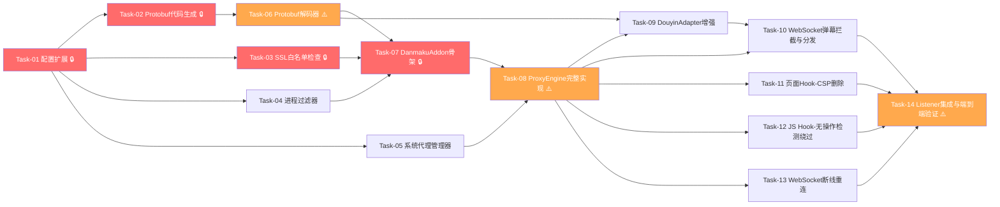

# 代理弹幕捕获引擎 — 开发任务计划

## 1. 任务概览

**总任务数**：14 个
**预计总工时**：870 分钟（约 14.5 小时）
**开发方法**：TDD — 每个任务按 RED → GREEN → REFACTOR 循环执行

**关键标注**：
- 🔒 阻塞任务：被多个任务依赖，建议优先完成
- ⚠️ 风险任务：技术难度高，可能需要额外时间

### 依赖关系图

### 可并行任务组

| 并行组 | 任务 | 说明 |
|--------|------|------|
| 1 | Task-02, Task-03, Task-04, Task-05 | 基础设施层四个独立模块，互不依赖（均依赖 Task-01） |
| 2 | Task-11, Task-12 | 页面 Hook 和 JS Hook 互相独立，可并行开发 |
| 3 | Task-09, Task-10 | DouyinAdapter 增强和 WS 拦截逻辑可并行（Task-10 依赖 Task-09 的解析结果格式） |

---

## 2. 开发任务

### 阶段一：基础设施

**阶段完成标准**：所有基础模块就绪——配置可读取、Protobuf 类可导入、SSL 白名单可判断、进程可过滤、系统代理可注册/关闭 ~~（已完成）~~

---

#### Task-01: 配置模型扩展 🔒

**通俗解释**：给系统加上代理功能需要的所有配置项，让后续模块知道代理端口、是否注册系统代理、哪些进程要拦截等

**做什么**：在 `Settings` 中新增 6 个配置项：`used_proxy`、`cert_dir`、`process_filter`、`force_polling`、`auto_pause`、`ssl_decrypt_hostnames`，支持环境变量覆盖

**涉及文件**：`danmaku_listener/config/settings.py`

**参考**：技术方案 §6（现有代码改动）→ AC-007, AC-016, AC-017

**依赖**：无

**预估工时**：30 分钟

**验证标准**：
- [x] `Settings()` 默认值：`used_proxy=True`、`cert_dir="~/.mitmproxy"`、`process_filter="chrome,msedge,QQBrowser,360se,firefox,2345Explorer,iexplore"`、`force_polling=False`、`auto_pause=False`、`ssl_decrypt_hostnames=""`
- [x] 环境变量 `USED_PROXY=false` → `settings.used_proxy == False`
- [x] 环境变量 `PROCESS_FILTER=chrome,msedge` → `settings.process_filter == "chrome,msedge"`
- [x] `settings.process_filter_list` 属性返回 `["chrome", "msedge", ...]`（逗号分割后的列表）
- [x] `settings.ssl_decrypt_extra_hostnames` 属性返回额外域名列表（逗号分割，空字符串返回空列表）

---

#### Task-02: Protobuf 代码生成 🔒

**通俗解释**：把抖音的 .proto 协议文件编译成 Python 类，让程序能读懂抖音弹幕的二进制数据

**做什么**：
1. 创建 `danmaku_listener/adapters/protocols/proto/` 包
2. 用 `protoc` 从 `DouyinBarrageGrab/BarrageGrab/proto/` 编译 `wss.proto` 和 `message.proto` 生成 `wss_pb2.py` 和 `message_pb2.py`
3. 在 `pyproject.toml` 中添加 `protobuf >= 4.21` 依赖
4. 验证生成的类可正常导入和序列化/反序列化

**涉及文件**：`danmaku_listener/adapters/protocols/proto/__init__.py`、`wss_pb2.py`、`message_pb2.py`、`pyproject.toml`

**参考**：技术方案 §5.9（Protobuf 代码生成策略）→ AC-004, AC-005

**依赖**：Task-01

**预估工时**：45 分钟

**验证标准**：
- [x] `from danmaku_listener.adapters.protocols.proto.wss_pb2 import WssResponse` 不报错
- [x] `from danmaku_listener.adapters.protocols.proto.message_pb2 import Response, Message, ChatMessage, GiftMessage, LikeMessage, MemberMessage, SocialMessage, ControlMessage, RoomUserSeqMessage, FansclubMessage` 不报错
- [x] `WssResponse()` 可实例化，设置 `seqid=1, payload=b"test"` 后 `SerializeToString()` 返回非空 bytes
- [x] `ChatMessage()` 可实例化，设置 `content="hello"` 后 `SerializeToString()` 返回非空 bytes
- [x] 序列化后反序列化数据一致：`msg = ChatMessage(content="hello"); msg2 = ChatMessage(); msg2.ParseFromString(msg.SerializeToString()); msg2.content == "hello"`

---

#### Task-03: SSL 白名单检查器 🔒

**通俗解释**：实现一个"门卫"，判断哪些网站的流量需要解密查看、哪些直接放行

**做什么**：实现 `check_host()` 函数和 `SSLWhitelistChecker` 类，支持精确匹配、通配符匹配（fnmatch）、正则匹配三种模式

**涉及文件**：`danmaku_listener/engines/ssl_whitelist.py`（新增）

**参考**：技术方案 §5.2（SSL 解密白名单）→ AC-002, AC-014, AC-016

**依赖**：Task-01

**预估工时**：45 分钟

**验证标准**：
- [x] `check_host("webcast3-ws-web-1.douyin.com")` 返回 `True`（正则匹配 `.*webcast.*`）
- [x] `check_host("live.douyin.com")` 返回 `True`（精确匹配）
- [x] `check_host("webcast.amemv.com")` 返回 `True`（精确匹配）
- [x] `check_host("lf-webcast-platform.bytetos.com")` 返回 `True`（通配符 `*-webcast-platform.bytetos.com`）
- [x] `check_host("www.baidu.com")` 返回 `False`（不在白名单）
- [x] `check_host("github.com")` 返回 `False`（不在白名单）
- [x] `check_host("WEBCAST3-WS-WEB-1.DOUYIN.COM")` 返回 `True`（大小写不敏感）
- [x] `SSLWhitelistChecker(extra_hostnames=["custom.example.com"])` → `check_host("custom.example.com")` 返回 `True`（额外域名追加）
- [x] `check_host("")` 返回 `False`（空字符串边界）

---

#### Task-04: 进程过滤器

**通俗解释**：实现一个"安检员"，只让指定浏览器（Chrome、Edge 等）的流量进入代理，其他程序的流量直接放行

**做什么**：实现 `ProcessFilter` 类，通过 psutil 端口反查 PID → 进程名，与白名单比对，带 PID→进程名缓存（TTL 30s）

**涉及文件**：`danmaku_listener/engines/process_filter.py`（新增）

**参考**：技术方案 §5.4（进程过滤）→ AC-007

**依赖**：Task-01

**预估工时**：60 分钟

**验证标准**：
- [x] `ProcessFilter()` 默认白名单包含 `"chrome", "msedge", "QQBrowser", "360se", "firefox", "2345Explorer", "iexplore"`
- [x] `ProcessFilter(allowed_processes=["chrome", "msedge"])` → `filter.allowed == {"chrome", "msedge"}`
- [x] `filter.is_allowed_pid(pid=1234, process_name="chrome")` 返回 `True`（白名单内）
- [x] `filter.is_allowed_pid(pid=1234, process_name="python")` 返回 `False`（不在白名单）
- [x] `filter.is_allowed_pid(pid=1234, process_name="Chrome")` 返回 `True`（大小写不敏感）
- [x] 缓存生效：连续两次调用 `is_allowed_pid` 同一 PID，第二次不调用 `psutil.Process`（通过 mock 验证）
- [x] 缓存过期：TTL 30s 后缓存失效，重新查询进程名
- [x] `psutil.NoSuchProcess` 异常时 `is_allowed_pid` 返回 `False`
- [x] `psutil.AccessDenied` 异常时 `is_allowed_pid` 返回 `True`（权限不足时放行，避免误拦截）

---

#### Task-05: 系统代理管理器

**通俗解释**：实现一个"开关"，启动时自动设置 Windows 系统代理指向我们的代理服务器，停止时自动恢复原样

**做什么**：实现 `SystemProxyManager` 类，通过 `winreg` 操作注册表 `HKCU\Software\Microsoft\Windows\CurrentVersion\Internet Settings`，支持注册/关闭/可配置开关

**涉及文件**：`danmaku_listener/managers/system_proxy_manager.py`（新增）

**参考**：技术方案 §5.8（系统代理管理）→ AC-008, AC-013, AC-017

**依赖**：Task-01

**预估工时**：60 分钟

**验证标准**：
- [x] `SystemProxyManager(enabled=True).register("127.0.0.1", 8827)` → 注册表 `ProxyEnable=1`、`ProxyServer="127.0.0.1:8827"`（通过 mock winreg 验证）
- [x] `spm.register()` 后 `spm.close()` → 注册表 `ProxyEnable=0`（恢复关闭状态）
- [x] `SystemProxyManager(enabled=False).register("127.0.0.1", 8827)` → 不修改注册表，返回 `True`
- [x] `SystemProxyManager(enabled=False).close()` → 不修改注册表，返回 `True`
- [x] `register()` 备份原始 `ProxyEnable` 和 `ProxyServer` 值到 `_original_proxy_enable` 和 `_original_proxy_server`
- [x] `close()` 时即使 `register()` 未被调用也不报错
- [x] `winreg.OpenKey` 抛出 `OSError` 时 `register()` 返回 `False`，记录警告日志
- [x] `close()` 在 `winreg` 操作失败时仍返回 `False` 而非抛出异常 → AC-013

---

#### Task-06: Protobuf 解码器 ⚠️

**通俗解释**：实现一个"翻译器"，把抖音发来的二进制弹幕数据翻译成程序能理解的结构化消息

**做什么**：实现 `ProtobufDecoder` 类，完整解码链路：raw bytes → WssResponse → 检查 compress_type → Gzip 解压（如需）→ Response → 遍历 Message → 返回 `List[DecodedMessage]`

**涉及文件**：`danmaku_listener/engines/protobuf_decoder.py`（新增）

**参考**：技术方案 §5.3（WebSocket 弹幕拦截与解码）→ AC-004, AC-005, AC-010, AC-011, AC-018

**依赖**：Task-02

**预估工时**：90 分钟

**验证标准**：
- [x] 构造 WssResponse（headers={"compress_type": "gzip"}, payload=gzip(Response)）→ `decoder.decode(raw_bytes)` 返回 `List[DecodedMessage]`，每个含 `method`、`payload`(bytes)、`msg_id`(str)
- [x] 构造 WssResponse（headers 无 compress_type）→ `decoder.decode(raw_bytes)` 直接用 payload 反序列化 Response
- [x] 构造含 ChatMessage 的完整链路：WssResponse → gzip(Response(messages=[Message(method="WebcastChatMessage", payload=ChatMessage(content="hello").SerializeToString(), msgId=123)])) → `decode()` 返回 1 条消息，`method="WebcastChatMessage"`, `msg_id="123"`
- [x] 传入无效 bytes（非 Protobuf 格式）→ `decode()` 返回空列表 `[]`，不抛异常 → AC-010
- [x] 构造 WssResponse（compress_type="gzip", payload=无效 gzip 数据）→ `decode()` 返回空列表 `[]`，记录警告日志 → AC-011
- [x] 构造 Response 反序列化失败（payload 为乱码）→ `decode()` 返回空列表 `[]`，记录错误日志 → AC-010
- [x] 空输入 `b""` → `decode()` 返回空列表 `[]`
- [x] `DecodedMessage` 数据类包含 `method: str`、`payload: bytes`、`msg_id: str` 三个字段

---

### 阶段二：代理启动与停止

**阶段完成标准**：调用 `ProxyEngine.start()` 后 mitmproxy 代理服务器在指定端口启动，系统代理可注册；调用 `stop()` 后代理停止，系统代理恢复 ~~（已完成）~~

---

#### Task-07: DanmakuAddon 骨架 🔒

**通俗解释**：创建 mitmproxy 的"插件骨架"，定义所有拦截钩子的入口，后续任务逐步填充每个钩子的逻辑

**做什么**：实现 `DanmakuAddon` 类，包含所有 mitmproxy 钩子方法（`http_connect`、`response`、`websocket_start`、`websocket_message`、`websocket_end`）的骨架实现，注入消息回调和配置

**涉及文件**：`danmaku_listener/engines/danmaku_addon.py`（新增）

**参考**：技术方案 §4（API 设计 - DanmakuAddon 内部钩子接口）→ AC-002, AC-003, AC-006

**依赖**：Task-03, Task-04

**预估工时**：60 分钟

**验证标准**：
- [x] `DanmakuAddon(message_callback=cb, settings=settings)` 可实例化
- [x] `addon.http_connect(flow)` 不抛异常（骨架实现，仅日志）
- [x] `addon.response(flow)` 不抛异常（骨架实现，仅日志）
- [x] `addon.websocket_start(flow)` 不抛异常（骨架实现，仅日志）
- [x] `addon.websocket_message(flow)` 不抛异常（骨架实现，仅日志）
- [x] `addon.websocket_end(flow)` 不抛异常（骨架实现，仅日志）
- [x] `addon` 实例包含 `ssl_checker: SSLWhitelistChecker` 和 `process_filter: ProcessFilter` 属性
- [x] `addon` 实例包含 `_message_callback` 和 `_settings` 属性

---

#### Task-08: ProxyEngine 完整实现 ⚠️

**通俗解释**：把代理引擎从"空壳"变成"真引擎"——启动时真正启动 mitmproxy 代理服务器，停止时真正关闭

**做什么**：完整实现 `ProxyEngine._start_proxy()` 和 `_stop_proxy()`，集成 DumpMaster、DanmakuAddon、SystemProxyManager、证书信任

**涉及文件**：`danmaku_listener/engines/proxy_engine.py`（改造）

**参考**：技术方案 §5.1（mitmproxy 与 asyncio 集成）→ AC-001, AC-008, AC-009

**依赖**：Task-05, Task-07

**预估工时**：120 分钟

**验证标准**：
- [x] `ProxyEngine()` 实例化后 `status == EngineStatus.STOPPED`
- [x] `await engine.start("123456")` → `status == EngineStatus.RUNNING` → AC-001
- [x] `await engine.start("123456")` 后 `await engine.stop("123456")` → `status == EngineStatus.STOPPED` → AC-008
- [x] 重复 `start` 同一 room_id 不报错（幂等）
- [x] 多个 room_id 共享同一 mitmproxy 实例（单例模式）：`start("111")` + `start("222")` → 只启动一次 mitmproxy
- [x] 端口冲突时 `start()` 抛出 `ProxyStartError`（通过 mock DumpMaster 模拟端口占用）
- [x] 证书信任失败时 `start()` 仍成功（仅记录警告日志）→ AC-009
- [x] `stop()` 时即使 mitmproxy 已异常退出，仍调用 `SystemProxyManager.close()` → AC-013
- [x] `stop()` 在 `finally` 块中执行系统代理恢复 → AC-013
- [x] `engine._addon` 是 `DanmakuAddon` 实例
- [x] `engine._system_proxy` 是 `SystemProxyManager` 实例

---

### 阶段三：弹幕捕获与解码

**阶段完成标准**：浏览器打开抖音直播间后，代理能拦截 WebSocket 弹幕流，解码 Protobuf 消息，转换为标准 DanmakuMessage 格式输出 ~~（已完成）~~

---

#### Task-09: DouyinAdapter Protobuf 增强

**通俗解释**：让抖音适配器不仅能读懂 JSON 格式的弹幕，还能读懂 Protobuf 二进制解码后的弹幕数据

**做什么**：增强 `DouyinAdapter.parse()` 方法，新增 Protobuf 解码数据的解析路径。Protobuf 解码后的数据为 `DecodedMessage(method, payload, msg_id)`，payload 需进一步反序列化为具体消息类型（ChatMessage、GiftMessage 等），提取字段转换为 DanmakuMessage

**涉及文件**：`danmaku_listener/adapters/douyin.py`（改造）

**参考**：技术方案 §7.3（DouyinAdapter Protobuf 支持）→ AC-004, AC-005

**依赖**：Task-06, Task-08

**预估工时**：90 分钟

**验证标准**：
- [x] 传入 `DecodedMessage(method="WebcastChatMessage", payload=ChatMessage(content="你好", user=User(nickname="测试用户")).SerializeToString(), msg_id="123")` → `parse()` 返回 `DanmakuMessage(platform="douyin", content="你好", user_name="测试用户", message_type="normal")` → AC-004
- [x] 传入 `DecodedMessage(method="WebcastGiftMessage", payload=GiftMessage(user=User(nickname="送礼者"), gift=GiftStruct(name="火箭", diamondCount=100), repeatCount=2).SerializeToString(), msg_id="456")` → `parse()` 返回 `DanmakuMessage(message_type="gift", gift_info.gift_name="火箭", gift_info.gift_count=2, gift_info.gift_value=100)` → AC-005
- [x] 传入 `DecodedMessage(method="WebcastLikeMessage", payload=LikeMessage(count=5, user=User(nickname="点赞者")).SerializeToString(), msg_id="789")` → `parse()` 返回 `DanmakuMessage(message_type="system", content="点赞者 点赞 x5")`
- [x] 传入 `DecodedMessage(method="WebcastMemberMessage", payload=MemberMessage(memberCount=100, user=User(nickname="进房者")).SerializeToString(), msg_id="012")` → `parse()` 返回 `DanmakuMessage(message_type="system", content="进房者 进入直播间 (当前100人)")`
- [x] 传入 `DecodedMessage(method="UnknownMessage", payload=b"", msg_id="999")` → `parse()` 返回 `None`（未知类型静默忽略）→ AC-018
- [x] 传入 `DecodedMessage(method="WebcastChatMessage", payload=b"invalid_protobuf", msg_id="111")` → `parse()` 返回 `None`，不抛异常（Protobuf 反序列化失败容错）
- [x] 原有 JSON 格式解析路径不受影响：传入 `{"method": "WebcastChatMessage", "payload": b'{"Content":"hello","User":{"Nickname":"test"}}'}` → 仍正常返回 DanmakuMessage
- [x] `can_parse()` 对 `DecodedMessage` 实例返回 `True`

---

#### Task-10: WebSocket 弹幕拦截与分发

**通俗解释**：让代理真正"听懂"弹幕流——识别 WebSocket 连接、拦截数据帧、解码并分发到事件总线

**做什么**：填充 `DanmakuAddon` 的 `websocket_start`、`websocket_message` 钩子逻辑，集成 ProtobufDecoder 和 DedupFilter

**涉及文件**：`danmaku_listener/engines/danmaku_addon.py`（改造）

**参考**：技术方案 §5.3（WebSocket 弹幕拦截与解码）→ AC-003, AC-004, AC-010, AC-011, AC-018, AC-019

**依赖**：Task-08, Task-09

**预估工时**：90 分钟

**验证标准**：
- [x] `websocket_start(flow)` 中 host 匹配 `webcast\d+-ws-web-\w+\.douyin\.com` → 调用 `_message_callback({type: "ws_connected", room_id: ...})`，日志记录新弹幕流 → AC-003
- [x] `websocket_start(flow)` 中 host 不匹配弹幕域名 → 不调用 callback
- [x] `websocket_message(flow)` 中 `from_client=True` → 忽略，不调用 callback
- [x] `websocket_message(flow)` 中 `from_client=False` + 进程过滤通过 → 调用 `ProtobufDecoder.decode()` → 对每条 `DecodedMessage` 调用 `_message_callback({raw_data, msg_id, platform, room_id})` → AC-004
- [x] `websocket_message(flow)` 中 Protobuf 解码失败 → 不崩溃，跳过该帧 → AC-010
- [x] `websocket_message(flow)` 中 Gzip 解压失败 → 不崩溃，跳过该帧 → AC-011
- [x] 相同 `msg_id` 的消息只分发一次（DedupFilter 集成）→ AC-019
- [x] 未知 method 的消息不分发，不记录错误 → AC-018
- [x] `room_id` 从 WebSocket URL 的 `room_id` 查询参数提取

---

### 阶段四：页面与脚本 Hook

**阶段完成标准**：浏览器打开抖音直播页时，CSP 头被自动删除（允许脚本执行），PausePop.js 的无操作检测被自动绕过 ~~（已完成）~~

---

#### Task-11: 页面 Hook — CSP 头删除

**通俗解释**：自动删除抖音直播页面的安全限制头，让注入的监听脚本可以正常执行

**做什么**：填充 `DanmakuAddon.response()` 钩子中的 CSP 删除逻辑

**涉及文件**：`danmaku_listener/engines/danmaku_addon.py`（改造）

**参考**：技术方案 §5.5（页面 Hook：CSP 头删除）→ AC-006

**依赖**：Task-08

**预估工时**：30 分钟

**验证标准**：
- [x] 构造 flow：`host="live.douyin.com"`, `content_type="text/html"`, response headers 含 `Content-Security-Policy: default-src 'self'` → `addon.response(flow)` 后 `Content-Security-Policy` 头被删除 → AC-006
- [x] 构造 flow：`host="live.douyin.com"`, `content_type="text/html"`, response headers 无 CSP → `addon.response(flow)` 不报错
- [x] 构造 flow：`host="www.baidu.com"`, `content_type="text/html"`, response headers 含 CSP → CSP 不被删除（非抖音域名）
- [x] 构造 flow：`host="live.douyin.com"`, `content_type="application/json"` → 不处理（非 HTML）
- [x] `auto_pause=True` 时：HTML 响应体中 `autoplay&quot;:true` 被替换为 `autoplay&quot;:false`

---

#### Task-12: JS Hook — 无操作检测绕过

**通俗解释**：自动修改抖音的"暂停弹窗"检测代码，让直播间不会因为"无操作"而弹出暂停提示

**做什么**：填充 `DanmakuAddon._hook_js()` 方法，检测 PausePop 文件并替换检测条件

**涉及文件**：`danmaku_listener/engines/danmaku_addon.py`（改造）

**参考**：技术方案 §5.6（JS Hook：无操作检测绕过）→ AC-015

**依赖**：Task-08

**预估工时**：45 分钟

**验证标准**：
- [x] 构造 flow：`url="https://lf-webcast-platform.bytetos.com/.../PausePop.ec38fcf8.js"`, `content_type="application/javascript"`, `status_code=200`, 响应体含 `if(!(0,a.DJ)()&&a.includes("live")){` → `addon.response(flow)` 后响应体中该段被替换为 `if(false){` → AC-015
- [x] 构造 flow：文件名不以 `pausepop` 开头 → 不修改响应体
- [x] 构造 flow：`status_code=304` → 不处理（非 200 响应）
- [x] 构造 flow：`content_type="text/html"` → 不处理（非 JS）
- [x] 构造 flow：JS 中无匹配正则 → 不修改响应体，不报错
- [x] `force_polling=True` 时：匹配 `if(!this.stopPolling)` 替换为 `if(true)`，修改 `this.errorInterval` 为配置值

---

### 阶段五：断线重连

**阶段完成标准**：WebSocket 连接意外断开时，代理检测到断开事件并触发 ReconnectManager 重连 ~~（已完成）~~

---

#### Task-13: WebSocket 断线重连

**通俗解释**：当弹幕流断线时，系统能自动检测到并尝试重新"接上"

**做什么**：填充 `DanmakuAddon.websocket_end()` 钩子，检测弹幕流断开，通知 ProxyEngine 触发 ReconnectManager

**涉及文件**：`danmaku_listener/engines/danmaku_addon.py`（改造）、`danmaku_listener/engines/proxy_engine.py`（改造）

**参考**：技术方案 §5.7（WebSocket 断线重连）→ AC-012

**依赖**：Task-08

**预估工时**：60 分钟

**验证标准**：
- [x] `websocket_end(flow)` 中 host 匹配弹幕域名 → 调用 `_message_callback({type: "ws_disconnect", room_id: ...})` → AC-012
- [x] `websocket_end(flow)` 中 host 不匹配弹幕域名 → 不触发断线事件
- [x] ProxyEngine 收到 `ws_disconnect` 消息 → 调用 `_handle_error_with_reconnect(room_id, ConnectionError(...))`
- [x] 重连成功（浏览器重新建立 WS 连接，`websocket_start` 匹配同一 room_id）→ `_emit_message({type: "reconnect_success", room_id})`
- [x] 重连失败（超过 max_retries 仍无新连接）→ `_emit_error(ConnectionError(...))`
- [x] `room_id` 从 flow 的 URL 查询参数提取，断线和重连使用同一 room_id 匹配

---

### 阶段六：集成与端到端验证

**阶段完成标准**：通过 DanmakuListener 主类启动代理模式监听，弹幕数据从代理拦截到最终输出完整闭环 ~~（已完成）~~

---

#### Task-14: Listener 集成与端到端验证 ⚠️

**通俗解释**：把所有零件组装起来，确保从"用户调用 start"到"收到弹幕消息"的整条链路畅通无阻

**做什么**：
1. 改造 `listener.py` 中 ProxyEngine 为单例模式（所有 douyin 房间共享）
2. 确保 ProxyEngine 的消息回调正确路由到 EventBus → DouyinAdapter → DanmakuMessage
3. 确保 SSL 白名单、进程过滤、CSP 删除、JS Hook 在集成场景下正常工作
4. 端到端集成测试：模拟完整弹幕捕获链路

**涉及文件**：`danmaku_listener/listener.py`（改造）、`tests/integration/test_proxy_danmaku.py`（新增）

**参考**：技术方案 §6（现有代码改动）→ AC-001, AC-003, AC-004, AC-005, AC-006, AC-008, AC-019

**依赖**：Task-10, Task-11, Task-12, Task-13

**预估工时**：120 分钟

**验证标准**：
- [x] `DanmakuListener().start(["douyin:123456"])` → ProxyEngine 单例创建并启动，`_engines["123456"]` 是 ProxyEngine 实例
- [x] `DanmakuListener().start(["douyin:111", "douyin:222"])` → 两个房间共享同一 ProxyEngine 实例（`_engines["111"] is _engines["222"]`）
- [x] 模拟 WebSocket 弹幕数据注入 → `on_danmaku` 回调收到 `DanmakuMessage(platform="douyin", content="你好", message_type="normal")`
- [x] 模拟礼物消息注入 → `on_danmaku` 回调收到 `DanmakuMessage(message_type="gift", gift_info=...)`
- [x] 模拟重复 msgId → `on_danmaku` 只触发一次 → AC-019
- [x] `DanmakuListener().stop()` → ProxyEngine 停止，系统代理恢复
- [x] 混合模式测试：`start(["douyin:111", "bilibili:222"])` → ProxyEngine + BrowserEngine 各自启动

---

## 3. AC 覆盖总表

| AC 编号 | 验收标准概述 | 承接任务 | 验证方式 | 状态 |
|---------|-------------|---------|---------|------|
| AC-001 | 代理服务器启动 | Task-08, Task-14 | ProxyEngine.start() → 单例创建 + status=RUNNING | ✅ |
| AC-002 | 域名白名单 SSL 解密 | Task-03, Task-07 | check_host() 白名单域名返回 True；tls_clienthello 设置 ignore_connection | ✅ |
| AC-003 | WebSocket 连接拦截 | Task-10, Task-14 | websocket_start 匹配弹幕域名 → callback → 消息路由 | ✅ |
| AC-004 | 弹幕消息解码与分发 | Task-09, Task-14 | ChatMessage → DanmakuMessage(content, message_type="normal") | ✅ |
| AC-005 | 礼物消息解码与分发 | Task-09, Task-14 | GiftMessage → DanmakuMessage(message_type="gift", gift_info) | ✅ |
| AC-006 | CSP 头删除 | Task-11 | HTML 响应中 CSP 头被删除 | ✅ |
| AC-007 | 进程过滤生效 | Task-04 | 白名单进程通过，非白名单进程被过滤 | ✅ |
| AC-008 | 代理停止与系统代理恢复 | Task-08, Task-14 | ProxyEngine.stop() → status=STOPPED + 系统代理恢复 | ✅ |
| AC-009 | 证书安装失败降级 | Task-08 | trust_certificate 失败 → 仅警告日志，start 仍成功 | ✅ |
| AC-010 | Protobuf 解码失败容错 | Task-06 | 无效 bytes → decode() 返回 []，不崩溃 | ✅ |
| AC-011 | Gzip 解压失败容错 | Task-06 | 无效 gzip 数据 → decode() 返回 []，记录警告 | ✅ |
| AC-012 | WebSocket 断线重连 | Task-13 | websocket_end → ReconnectManager 触发 | ✅ |
| AC-013 | 系统代理恢复保障 | Task-05, Task-08 | stop() 在 finally 中执行 SystemProxyManager.close() | ✅ |
| AC-014 | 非白名单域名不解密 | Task-03 | check_host("github.com") → False → ignore_connection=True | ✅ |
| AC-015 | JS 无操作检测绕过 | Task-12 | PausePop.js 中检测条件替换为 if(false){ | ✅ |
| AC-016 | SSL 解密白名单约束 | Task-03 | check_host 仅白名单返回 True，其余 False | ✅ |
| AC-017 | 系统代理可配置开关 | Task-05 | used_proxy=False → 不修改注册表 | ✅ |
| AC-018 | 未知消息类型静默忽略 | Task-06, Task-09 | 未知 method → 不触发事件，不记录错误 | ✅ |
| AC-019 | 重复消息去重 | Task-10, Task-14 | 相同 msgId → DedupFilter 过滤，只触发一次 | ✅ |

---

## 4. 完成定义

- [x] 所有 14 个任务的验证标准（测试用例）通过
- [x] AC 覆盖总表中每条 AC 的验证方式已执行并通过
- [x] `& "D:\AI\EDTalk\runtime312\python.exe" -m pytest tests/ -v` 全量测试通过（433 passed, 0 failed，无回归）
- [x] mitmproxy 依赖安装成功：`pip install mitmproxy>=10.0 protobuf>=4.21`
- [x] Protobuf 生成文件 `wss_pb2.py` 和 `message_pb2.py` 已提交到 Git
- [ ] 手动验收：启动代理 → 浏览器打开抖音直播页 → 弹幕实时输出 → 停止代理 → 系统代理恢复
