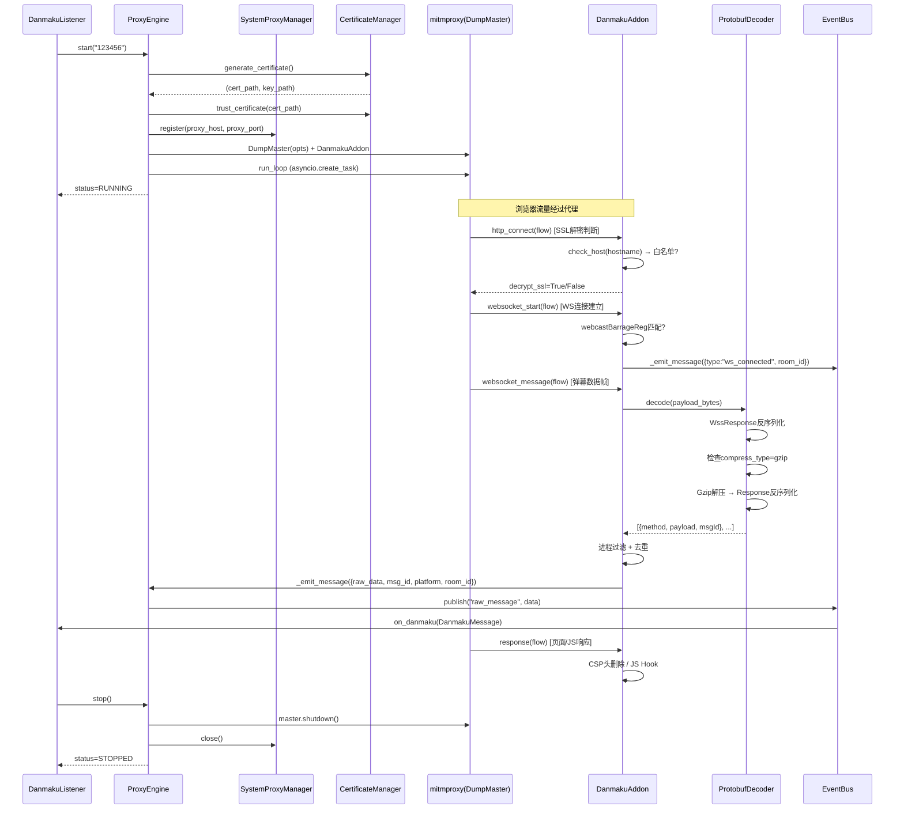

# 代理弹幕捕获引擎 — 技术设计文档

## 1. 设计概要

**功能描述**：用 mitmproxy 替代 DouyinBarrageGrab 中的 Titanium.Web.Proxy，实现完整的代理弹幕捕获闭环——代理自动拦截浏览器与抖音 WebSocket 服务端之间的弹幕流量，实时解码 Protobuf 消息并转换为标准 DanmakuMessage 格式输出。

**影响范围**：`engines/proxy_engine.py`（核心改造）、`adapters/douyin.py`（Protobuf 解析增强）、`adapters/protocols/`（新增 proto 生成模块）、`managers/certificate_manager.py`（复用+增强）、`managers/system_proxy_manager.py`（新增）、`config/settings.py`（新增配置项）、`listener.py`（ProxyEngine 实例化改造）

**技术难点**：
1. mitmproxy 与 asyncio 事件循环的集成——mitmproxy 内部有自己的事件循环，需确保与 DanmakuListener 的 asyncio 循环正确共存
2. Protobuf 消息解码链路——WssResponse → Gzip 解压 → Response → Message → 按类型反序列化，需处理多种异常场景
3. 进程过滤——mitmproxy 不原生提供进程名过滤，需通过进程 PID 反查进程名实现

**外部依赖**：
- `mitmproxy`（新增，版本 >= 10.0）
- `protobuf`（新增，用于 .proto 编译后的 Python 类反序列化）
- `psutil`（已有，用于进程名查询）

---

## 2. 架构概览

本功能属于**复杂功能**（跨多模块、涉及异步集成、外部服务），采用模块职责表 + Mermaid 时序图 + 数据流说明。

### 模块职责表

| 模块 | 职责 | 新增/改造 |
|------|------|----------|
| `ProxyEngine` | 代理引擎主控，管理 mitmproxy 生命周期、系统代理注册、消息分发 | 改造（骨架→完整实现） |
| `DanmakuAddon` | mitmproxy addon，拦截 WebSocket/HTTP 响应，执行域名白名单/进程过滤/页面Hook/JS Hook | 新增 |
| `ProtobufDecoder` | Protobuf + Gzip 解码链路，WssResponse → Response → Message → 类型分发 | 新增 |
| `SystemProxyManager` | Windows 注册表系统代理注册/关闭，可配置开关 | 新增 |
| `CertificateManager` | SSL 证书生成与信任（已有，复用） | 复用（无需改动） |
| `DouyinAdapter` | 抖音消息解析（已有，需增强支持 Protobuf 对象输入） | 改造 |
| `Settings` | 新增代理相关配置项 | 改造 |
| `DedupFilter` | 消息去重（已有，复用） | 复用 |

### 核心时序图



### 数据流说明

1. **入站**：浏览器 → 系统代理 → mitmproxy → DanmakuAddon 拦截
2. **SSL 解密决策**：`http_connect` 钩子 → `check_host()` 白名单判断 → `flow.request.stealth.ssl_passthrough = not in_whitelist`
3. **WebSocket 弹幕流**：`websocket_message` 钩子 → ProtobufDecoder 解码 → 去重 → `_emit_message` → EventBus → DouyinAdapter → DanmakuMessage
4. **页面 Hook**：`response` 钩子 → 检测 `text/html` + `live.douyin.com` → 删除 CSP 头
5. **JS Hook**：`response` 钩子 → 检测 `application/javascript` + `PausePop` 文件名 → 替换检测条件

---

## 3. 数据库设计

本项目无数据库，此节不适用。

---

## 4. API 设计

本功能为内部引擎模块，无 REST API。核心接口为 ProxyEngine 的生命周期方法和内部事件回调。

### `ProxyEngine.start(room_id)` → AC-001

**描述**：启动代理服务器，注册系统代理，开始拦截流量

**流程**：
1. 检查是否已启动（单例模式，一个 ProxyEngine 实例对应一个 mitmproxy 进程）
2. CertificateManager 生成/加载证书
3. CertificateManager 信任证书（失败仅警告，不阻止启动）→ AC-009
4. SystemProxyManager 注册系统代理（如果 `used_proxy=True`）→ AC-017
5. 创建 DumpMaster + DanmakuAddon，启动 mitmproxy 事件循环
6. 状态变为 RUNNING

**异常**：
| 场景 | 处理 | 对应 AC |
|------|------|---------|
| 端口被占用 | 抛出 `ProxyStartError`，状态保持 STOPPED | AC-001 |
| 证书安装失败 | 记录警告日志，继续启动 | AC-009 |
| 系统代理注册失败（无管理员权限） | 记录警告日志，代理服务器仍正常运行 | AC-009 |

### `ProxyEngine.stop(room_id)` → AC-008, AC-013

**描述**：停止代理服务器，恢复系统代理设置

**流程**：
1. 调用 `master.shutdown()` 停止 mitmproxy
2. SystemProxyManager 关闭系统代理（即使 mitmproxy 已异常退出也执行）→ AC-013
3. 状态变为 STOPPED

**异常**：
| 场景 | 处理 | 对应 AC |
|------|------|---------|
| mitmproxy 已异常退出 | 仍执行系统代理恢复 | AC-013 |
| 系统代理恢复失败 | 记录错误日志 | AC-013 |

### `DanmakuAddon` 内部钩子接口

| 钩子方法 | mitmproxy 事件 | 职责 | 对应 AC |
|----------|---------------|------|---------|
| `http_connect(flow)` | HTTP CONNECT 请求 | SSL 解密决策（白名单判断） | AC-002, AC-014, AC-016 |
| `response(flow)` | HTTP 响应 | CSP 删除 + JS Hook | AC-006, AC-015 |
| `websocket_start(flow)` | WebSocket 连接建立 | 识别弹幕流，记录 room_id | AC-003 |
| `websocket_message(flow)` | WebSocket 消息 | Protobuf 解码 + 消息分发 | AC-004, AC-005, AC-010, AC-011, AC-018, AC-019 |
| `websocket_end(flow)` | WebSocket 连接关闭 | 触发重连 | AC-012 |

---

## 5. 核心逻辑

### 5.1 mitmproxy 与 asyncio 集成 → AC-001

**触发条件**：ProxyEngine.start() 被调用

**处理流程**：
1. 创建 `mitmproxy.options.Options()`，设置 `listen_host`/`listen_port`/`ssl_insecure`
2. 配置证书路径：`opts.confdir = cert_dir`，mitmproxy 自动加载/生成根证书
3. 创建 `DanmakuAddon` 实例，注入消息回调
4. 创建 `DumpMaster(opts)`，注册 addon
5. 通过 `asyncio.create_task` 在当前事件循环中运行 `master.run_loop()` — mitmproxy 10+ 的 `run_loop` 方法接受 `loop` 参数，可与现有 asyncio 循环共存
6. 端口冲突时 `master.run_loop()` 会抛出异常，捕获后转为 `ProxyStartError`

**关键代码结构**：
```python
class ProxyEngine(BaseEngine):
    def __init__(self):
        super().__init__()
        self._master: Optional[DumpMaster] = None
        self._addon: Optional[DanmakuAddon] = None
        self._system_proxy: Optional[SystemProxyManager] = None
        self._cert_manager: Optional[CertificateManager] = None
        self._started: bool = False  # 单例标记

    async def _start_proxy(self, room_id: str) -> None:
        if self._started:
            return  # 代理已启动，仅记录房间
        # 1. 证书管理
        # 2. 系统代理注册
        # 3. 启动 mitmproxy
        self._started = True

    async def _stop_proxy(self, room_id: str) -> None:
        # 仅在最后一个房间停止时关闭代理
        if self._master:
            self._master.shutdown()
        if self._system_proxy:
            self._system_proxy.close()
        self._started = False
```

### 5.2 SSL 解密白名单 → AC-002, AC-014, AC-016

**触发条件**：每个 HTTPS CONNECT 请求到达代理

**处理流程**：
1. 在 `http_connect` 钩子中获取 `flow.request.host`
2. 调用 `check_host(hostname)` 判断是否在白名单
3. 白名单内：允许 SSL 解密（默认行为）
4. 白名单外：设置 `flow.request.stealth.ssl_passthrough = True`，直接转发不解密

**白名单规则**（对应 BR-001）：
```python
SSL_DECRYPT_HOSTNAMES = [
    "lf-cdn-tos.bytescm.com",           # 脚本CDN
    "live.douyin.com",                   # 直播页面
    "webcast.amemv.com",                 # 直播伴侣API
    "*-webcast-platform.bytetos.com",    # 新脚本地址
]

SSL_DECRYPT_PATTERNS = [
    re.compile(r".*webcast.*"),          # 所有含 webcast 的域名
    re.compile(r"webcast\d+-ws-web-\w+\.(douyin|amemv)\.com"),  # WS弹幕域名
]

def check_host(hostname: str) -> bool:
    hostname = hostname.strip().lower()
    # 精确匹配
    if hostname in [h.lower() for h in SSL_DECRYPT_HOSTNAMES]:
        return True
    # 通配符匹配
    for pattern in SSL_DECRYPT_HOSTNAMES:
        if "*" in pattern and fnmatch.fnmatch(hostname, pattern.lower()):
            return True
    # 正则匹配
    for regex in SSL_DECRYPT_PATTERNS:
        if regex.match(hostname):
            return True
    return False
```

### 5.3 WebSocket 弹幕拦截与解码 → AC-003, AC-004, AC-005, AC-010, AC-011, AC-018, AC-019

**触发条件**：WebSocket 消息到达

**处理流程**：

```mermaid
flowchart TD
    A[websocket_message 钩子] --> B{from_client?}
    B -->|是| Z[忽略客户端消息]
    B -->|否| C{进程过滤?}
    C -->|不在白名单| Z
    C -->|在白名单| D[获取 flow.websocket.messages[-1].content]
    D --> E[ProtobufDecoder.decode]
    E --> F[WssResponse 反序列化]
    F --> G{headers 含 compress_type=gzip?}
    G -->|否| H[直接用 payload]
    G -->|是| I[Gzip 解压 payload]
    I -->|解压失败| J[记录警告,跳过该帧 → AC-011]
    I -->|解压成功| H
    H --> K[Response 反序列化]
    K -->|失败| L[记录错误,不崩溃 → AC-010]
    K -->|成功| M[遍历 Response.messages]
    M --> N{msgId 去重? → AC-019}
    N -->|重复| O[跳过]
    N -->|新消息| P{method 在已知类型?}
    P -->|否| Q[静默忽略 → AC-018]
    P -->|是| R[反序列化具体类型]
    R -->|失败| L
    R -->|成功| S[_emit_message → EventBus]
```

**ProtobufDecoder 核心逻辑**：
```python
class ProtobufDecoder:
    """Protobuf + Gzip 解码器"""

    def decode(self, raw_bytes: bytes) -> List[DecodedMessage]:
        """解码 WebSocket 二进制帧

        Args:
            raw_bytes: WebSocket 数据帧的原始字节

        Returns:
            解码后的消息列表
        """
        # Step 1: 反序列化 WssResponse
        wss_response = WssResponse()
        try:
            wss_response.ParseFromString(raw_bytes)
        except Exception as e:
            logger.error(f"Protobuf WssResponse decode failed: {e}")
            return []  # → AC-010

        # Step 2: 检查压缩类型
        compress_type = wss_response.headers.get("compress_type", "")
        payload = wss_response.payload

        if compress_type == "gzip":
            try:
                payload = gzip.decompress(payload)
            except Exception as e:
                logger.warning(f"Gzip decompress failed: {e}")
                return []  # → AC-011

        # Step 3: 反序列化 Response
        response = Response()
        try:
            response.ParseFromString(payload)
        except Exception as e:
            logger.error(f"Protobuf Response decode failed: {e}")
            return []  # → AC-010

        # Step 4: 遍历消息
        results = []
        for msg in response.messages:
            results.append(DecodedMessage(
                method=msg.method,
                payload=msg.payload,
                msg_id=str(msg.msgId),
            ))
        return results
```

### 5.4 进程过滤 → AC-007

**触发条件**：每个请求/响应到达代理

**处理方案**：

mitmproxy 不直接提供进程名，但提供 `flow.client_conn.peername`（客户端 IP:端口）。通过以下方式实现进程过滤：

1. 在 `http_connect` 钩子中，获取客户端连接的本地端口
2. 使用 `psutil.net_connections()` 查找该端口对应的 PID
3. 通过 `psutil.Process(pid).name()` 获取进程名
4. 与白名单比对

**优化**：缓存 PID→进程名映射（TTL 30 秒），避免每次请求都查询。

```python
class ProcessFilter:
    """进程过滤器"""

    DEFAULT_ALLOWED = ["chrome", "msedge", "QQBrowser", "360se",
                       "firefox", "2345Explorer", "iexplore"]

    def __init__(self, allowed_processes: Optional[List[str]] = None):
        self.allowed = set(p.lower() for p in (allowed_processes or self.DEFAULT_ALLOWED))
        self._cache: Dict[int, Tuple[str, float]] = {}  # pid → (name, timestamp)
        self._cache_ttl = 30.0

    def is_allowed(self, flow) -> bool:
        """判断请求来源进程是否在白名单中"""
        try:
            client_port = flow.client_conn.peername[1]
            pid = self._find_pid_by_port(client_port)
            if pid is None:
                return False
            process_name = self._get_process_name(pid)
            return process_name.lower() in self.allowed
        except Exception:
            return True  # 查询失败时放行，避免误拦截

    def _find_pid_by_port(self, port: int) -> Optional[int]:
        for conn in psutil.net_connections():
            if conn.laddr.port == port and conn.status == 'ESTABLISHED':
                return conn.pid
        return None

    def _get_process_name(self, pid: int) -> str:
        now = time.time()
        if pid in self._cache:
            name, ts = self._cache[pid]
            if now - ts < self._cache_ttl:
                return name
        try:
            name = psutil.Process(pid).name()
            self._cache[pid] = (name, now)
            return name
        except (psutil.NoSuchProcess, psutil.AccessDenied):
            return ""
```

### 5.5 页面 Hook：CSP 头删除 → AC-006

**触发条件**：HTTP 响应到达，且为 `live.douyin.com` 的 HTML 页面

**处理流程**：
1. 在 `response` 钩子中检查 `flow.request.host`
2. 检查 `Content-Type` 是否包含 `text/html`
3. 如果响应头中存在 `Content-Security-Policy`，删除该头
4. 可选：替换 `autoplay&quot;:true` 为 `autoplay&quot;:false` 禁用自动播放

```python
def response(self, flow: http.HTTPFlow) -> None:
    # CSP 删除
    if flow.response and "text/html" in (flow.response.headers.get("content-type", "")):
        if "Content-Security-Policy" in flow.response.headers:
            del flow.response.headers["Content-Security-Policy"]
            logger.debug(f"Removed CSP header for {flow.request.pretty_url}")
```

### 5.6 JS Hook：无操作检测绕过 → AC-015

**触发条件**：HTTP 响应到达，且为 `application/javascript` 类型，文件名以 `PausePop` 开头

**处理流程**：
1. 在 `response` 钩子中检查 `Content-Type` 是否包含 `application/javascript`
2. 提取 URL 文件名，检查是否以 `pausepop` 开头（不区分大小写）
3. 获取响应体文本
4. 用正则匹配 `if(!(\d{1,},\w{1,}\.DJ\)\().+\w{1,}\.includes\("live"\)\))\{`
5. 替换为 `if(false){`
6. 设置修改后的响应体

```python
def _hook_js(self, flow: http.HTTPFlow) -> None:
    content_type = flow.response.headers.get("content-type", "")
    if "application/javascript" not in content_type.lower():
        return
    if flow.response.status_code != 200:
        return

    url = flow.request.pretty_url
    filename = url.split("?")[0].rsplit("/", 1)[-1]

    # PausePop 检测绕过
    if filename.lower().startswith("pausepop"):
        js = flow.response.get_text()
        pattern = re.compile(r'if\(!\(\d{1,},\w{1,}\.DJ\)\(\).+\w{1,}\.includes\("live"\)\)\)\{')
        if pattern.search(js):
            js = pattern.sub("if(false){", js)
            flow.response.set_text(js)
            logger.info(f"Bypassed JS idle detection: {filename}")
```

### 5.7 WebSocket 断线重连 → AC-012

**触发条件**：`websocket_end` 钩子触发

**处理流程**：
1. 在 `websocket_end` 钩子中，检查断开的连接是否为弹幕流
2. 如果是，通过 `_emit_error` 通知 ProxyEngine
3. ProxyEngine 调用 `_handle_error_with_reconnect`（继承自 BaseEngine）
4. ReconnectManager 执行指数退避重连

**注意**：代理模式下的"重连"不是重新建立 WebSocket 连接（由浏览器自动完成），而是检测到断开后等待浏览器重新建立 WS 连接，代理重新订阅。因此重连逻辑为：
- `websocket_end` → 标记该 room_id 的 WS 连接断开
- 等待 `websocket_start` → 如果新连接匹配同一 room_id，重连成功
- 如果超过 `reconnect_max_retries * max_delay` 仍无新连接，重连失败

```python
def websocket_end(self, flow: http.HTTPFlow) -> None:
    host = flow.request.host
    if self._webcast_pattern.match(host):
        room_id = self._extract_room_id(flow)
        if room_id:
            error = ConnectionError(f"WebSocket disconnected for room {room_id}")
            asyncio.create_task(self._on_ws_disconnect(room_id, error))

async def _on_ws_disconnect(self, room_id: str, error: Exception) -> None:
    # 通知 ProxyEngine，由其调用 _handle_error_with_reconnect
    if self._message_callback:
        await self._message_callback({
            "type": "ws_disconnect",
            "room_id": room_id,
            "error": str(error),
        })
```

### 5.8 系统代理管理 → AC-008, AC-013, AC-017

**触发条件**：ProxyEngine 启动/停止时

**处理流程**：
1. 启动时：如果 `used_proxy=True`，修改注册表 `HKCU\Software\Microsoft\Windows\CurrentVersion\Internet Settings`
   - `ProxyEnable` = 1
   - `ProxyServer` = `127.0.0.1:{port}`
2. 停止时：恢复 `ProxyEnable` = 0
3. 如果 `used_proxy=False`，不触碰注册表 → AC-017
4. 停止时即使 mitmproxy 已异常退出，仍执行恢复 → AC-013

```python
class SystemProxyManager:
    """Windows 系统代理管理器"""

    REGISTRY_PATH = r"Software\Microsoft\Windows\CurrentVersion\Internet Settings"

    def __init__(self, enabled: bool = True):
        self.enabled = enabled
        self._original_proxy_enable: Optional[int] = None
        self._original_proxy_server: Optional[str] = None

    def register(self, host: str, port: int) -> bool:
        if not self.enabled:
            logger.info("System proxy registration disabled by config")
            return True
        try:
            key = winreg.OpenKey(winreg.HKEY_CURRENT_USER, self.REGISTRY_PATH, 0, winreg.KEY_SET_VALUE)
            # 备份原始值
            self._original_proxy_enable = winreg.QueryValueEx(key, "ProxyEnable")[0]
            self._original_proxy_server = winreg.QueryValueEx(key, "ProxyServer")[0]
            # 设置新值
            winreg.SetValueEx(key, "ProxyEnable", 0, winreg.REG_DWORD, 1)
            winreg.SetValueEx(key, "ProxyServer", 0, winreg.REG_SZ, f"{host}:{port}")
            winreg.CloseKey(key)
            logger.info(f"System proxy registered: {host}:{port}")
            return True
        except Exception as e:
            logger.warning(f"Failed to register system proxy: {e}")
            return False

    def close(self) -> bool:
        if not self.enabled:
            return True
        try:
            key = winreg.OpenKey(winreg.HKEY_CURRENT_USER, self.REGISTRY_PATH, 0, winreg.KEY_SET_VALUE)
            winreg.SetValueEx(key, "ProxyEnable", 0, winreg.REG_DWORD, 0)
            winreg.CloseKey(key)
            logger.info("System proxy closed")
            return True
        except Exception as e:
            logger.error(f"Failed to close system proxy: {e}")
            return False
```

### 5.9 Protobuf 代码生成策略

**方案**：复用 DouyinBarrageGrab 的 `.proto` 文件，通过 `protoc` 编译生成 Python 类。

**文件组织**：
```
danmaku_listener/adapters/protocols/
├── message_types.py          # 已有，消息类型枚举
├── proto/                    # 新增
│   ├── __init__.py
│   ├── wss_pb2.py            # protoc 生成
│   └── message_pb2.py        # protoc 生成
└── protobuf_decoder.py       # 新增，解码器
```

**生成命令**：
```bash
protoc --python_out=danmaku_listener/adapters/protocols/proto/ \
       --proto_path=DouyinBarrageGrab/BarrageGrab/proto/ \
       wss.proto message.proto
```

**集成方式**：在 `pyproject.toml` 中添加 `protobuf` 依赖，在开发文档中记录生成命令。生成的 `_pb2.py` 文件提交到 Git（避免开发者需要安装 protoc）。

---

## 6. 现有代码改动

| 模块 / 文件 | 改动内容 | 原因 | 对应 AC |
|-------------|---------|------|---------|
| `engines/proxy_engine.py` | 完整实现 `_start_proxy`/`_stop_proxy`，集成 mitmproxy DumpMaster、DanmakuAddon、SystemProxyManager、CertificateManager | 骨架→完整实现 | AC-001, AC-008, AC-012, AC-013 |
| `adapters/douyin.py` | 增强 `parse()` 方法，支持接收 Protobuf 解码后的字典数据（含 `common`、`user`、`content` 等字段） | 当前 DouyinAdapter 仅支持 JSON 格式，需支持 Protobuf 对象 | AC-004, AC-005 |
| `adapters/protocols/message_types.py` | 无改动，已有完整的 8 种消息类型映射 | 已满足需求 | AC-018 |
| `config/settings.py` | 新增配置项：`used_proxy`、`ssl_decrypt_hostnames`、`process_filter`、`force_polling`、`auto_pause`、`cert_dir` | 代理功能需要可配置 | AC-007, AC-016, AC-017 |
| `listener.py` | ProxyEngine 改为单例模式（所有 douyin 房间共享一个 ProxyEngine 实例） | mitmproxy 只需启动一次，多房间共享 | AC-001 |
| `managers/certificate_manager.py` | 无改动，复用现有 `generate_certificate()` 和 `trust_certificate()` | 已满足需求 | AC-009 |
| `bus/dedup_filter.py` | 无改动，复用现有 `should_filter()` | 已满足需求 | AC-019 |

---

## 7. 技术决策

### 7.1 mitmproxy 运行模式：DumpMaster vs 独立进程

**背景**：mitmproxy 有多种运行方式——命令行脚本模式（`mitmproxy -s addon.py`）、DumpMaster 编程模式、ProxyServer 底层 API。需要选择与 asyncio 兼容且便于控制的模式。

**选项**：
- A: **DumpMaster 编程模式** — 在 Python 代码中创建 `DumpMaster(options)`，通过 `asyncio.create_task(master.run_loop())` 运行。优势：与 asyncio 共存、可编程控制生命周期、可直接传递回调。代价：需理解 DumpMaster 内部 API。
- B: **命令行脚本模式** — 通过 `subprocess` 启动 `mitmproxy -s addon.py`，addon 通过文件/socket 与主进程通信。优势：进程隔离、稳定。代价：IPC 复杂、延迟高、进程管理开销。
- C: **ProxyServer 底层 API** — 直接使用 `mitmproxy.proxy.ProxyServer`，手动管理事件循环。优势：最轻量。代价：需手动实现 addon 加载、选项管理等，工作量大。

**结论**：选 A（DumpMaster 编程模式）。mitmproxy 10+ 的 `DumpMaster.run_loop()` 支持与 asyncio 事件循环共存，且提供完整的 addon 管理和生命周期控制，是最适合嵌入现有 asyncio 应用的方式。

### 7.2 进程过滤实现方式

**背景**：DouyinBarrageGrab 通过 Titanium.Web.Proxy 的 `e.HttpClient.ProcessId` 直接获取进程 ID。mitmproxy 不原生提供此信息。

**选项**：
- A: **psutil 端口反查** — 通过 `psutil.net_connections()` 根据客户端端口查找 PID，再查进程名。优势：无需额外依赖（psutil 已有）、实现简单。代价：每次查询有少量开销（通过缓存缓解）。
- B: **不实现进程过滤** — 依赖域名白名单已足够限制拦截范围。优势：简单。代价：所有经过代理的流量都会被检查，包括非浏览器的流量。

**结论**：选 A（psutil 端口反查）。进程过滤是 AC-007 的明确要求，且白名单+进程过滤双重限制更安全。缓存机制可将性能影响降到最低。

### 7.3 DouyinAdapter Protobuf 支持：增强现有 vs 新建适配器

**背景**：当前 DouyinAdapter 解析 JSON 格式数据（`method` + `payload` 字典）。Protobuf 解码后的数据结构不同（`ChatMessage.common`、`ChatMessage.user`、`ChatMessage.content` 等）。

**选项**：
- A: **增强现有 DouyinAdapter** — 在 `parse()` 中检测数据格式，Protobuf 对象走新解析路径，JSON 走现有路径。优势：一个适配器统一处理、调用方无需改动。代价：适配器内部逻辑变复杂。
- B: **新建 ProtobufDouyinAdapter** — 专门处理 Protobuf 格式。优势：职责单一。代价：调用方需根据数据来源选择适配器、增加维护成本。

**结论**：选 A（增强现有 DouyinAdapter）。Protobuf 解码后的数据已经是 Python 对象（有 `.common`、`.user`、`.content` 属性），可以统一转换为字典后走现有解析路径。在 `parse()` 入口处做格式检测即可，不会显著增加复杂度。

### 7.4 证书管理：复用 CertificateManager vs 使用 mitmproxy 内置

**背景**：mitmproxy 有内置的证书管理（`certstore`），自动生成根证书和站点证书。项目已有 `CertificateManager` 使用 `cryptography` 库手动生成证书。

**选项**：
- A: **使用 mitmproxy 内置证书管理** — 设置 `opts.confdir`，mitmproxy 自动在 `~/.mitmproxy/` 生成和管理证书。优势：零配置、自动处理站点证书生成。代价：需手动调用 `certutil` 信任根证书。
- B: **复用 CertificateManager** — 使用现有代码生成证书，然后配置 mitmproxy 加载。优势：统一证书管理。代价：mitmproxy 的证书格式要求与 CertificateManager 的输出不完全兼容，需适配。

**结论**：选 A（使用 mitmproxy 内置证书管理）。mitmproxy 的证书管理已经过充分测试，支持自动生成站点证书、证书缓存等。只需在首次启动后调用 `certutil -addstore Root mitmproxy-ca-cert.pem` 信任根证书即可。CertificateManager 保留用于其他场景，但代理引擎不再使用它。

---

## 8. 安全与性能

**输入校验**：Protobuf 解码失败时静默忽略，不崩溃 → AC-010。Gzip 解压失败时跳过该帧 → AC-011。

**性能考量**：
- SSL 解密仅对白名单域名生效，非白名单域名直接转发（`ssl_passthrough`），避免不必要的解密开销 → AC-014, AC-016
- 进程过滤使用 PID→进程名缓存（TTL 30s），避免每次请求都调用 `psutil.net_connections()`
- DedupFilter 使用并行 set 索引实现 O(1) 查重 → AC-019
- WebSocket 消息处理在 asyncio 事件循环中同步执行（Protobuf 反序列化是 CPU 密集但耗时极短，<1ms），不阻塞事件循环

**敏感数据处理**：
- 系统代理注册涉及 Windows 注册表操作，需在 `close()` 中确保恢复 → AC-013
- SSL 证书私钥存储在 `~/.mitmproxy/` 目录，需确保目录权限安全
- 日志中遮蔽 Cookie、Token 等敏感信息（复用 `mask_sensitive()`）

---

## 9. AC 覆盖总表

| AC 编号 | 验收标准概述 | 实现位置 |
|---------|-------------|---------|
| AC-001 | 代理服务器启动 | 核心逻辑 5.1（ProxyEngine._start_proxy + DumpMaster） |
| AC-002 | 域名白名单 SSL 解密 | 核心逻辑 5.2（DanmakuAddon.http_connect + check_host） |
| AC-003 | WebSocket 连接拦截 | 核心逻辑 5.3（DanmakuAddon.websocket_start + webcastBarrageReg） |
| AC-004 | 弹幕消息解码与分发 | 核心逻辑 5.3（ProtobufDecoder + DouyinAdapter.parse chat路径） |
| AC-005 | 礼物消息解码与分发 | 核心逻辑 5.3（ProtobufDecoder + DouyinAdapter.parse gift路径） |
| AC-006 | CSP 头删除 | 核心逻辑 5.5（DanmakuAddon.response + CSP检测） |
| AC-007 | 进程过滤生效 | 核心逻辑 5.4（ProcessFilter + psutil端口反查） |
| AC-008 | 代理停止与系统代理恢复 | 核心逻辑 5.8（ProxyEngine._stop_proxy + SystemProxyManager.close） |
| AC-009 | 证书安装失败降级 | 核心逻辑 5.1（trust_certificate失败仅警告）+ 5.8（mitmproxy内置证书+certutil） |
| AC-010 | Protobuf 解码失败容错 | 核心逻辑 5.3（ProtobufDecoder.decode try/except） |
| AC-011 | Gzip 解压失败容错 | 核心逻辑 5.3（ProtobufDecoder.decode gzip try/except） |
| AC-012 | WebSocket 断线重连 | 核心逻辑 5.7（DanmakuAddon.websocket_end + ReconnectManager） |
| AC-013 | 系统代理恢复保障 | 核心逻辑 5.8（SystemProxyManager.close 在 finally 中执行） |
| AC-014 | 非白名单域名不解密 | 核心逻辑 5.2（ssl_passthrough = True for non-whitelist） |
| AC-015 | JS 无操作检测绕过 | 核心逻辑 5.6（DanmakuAddon._hook_js + PausePop正则替换） |
| AC-016 | SSL 解密白名单约束 | 核心逻辑 5.2（check_host 仅白名单返回 True） |
| AC-017 | 系统代理可配置开关 | 核心逻辑 5.8（SystemProxyManager.enabled = settings.used_proxy） |
| AC-018 | 未知消息类型静默忽略 | 核心逻辑 5.3（method 不在 MESSAGE_TYPE_MAP → 跳过） |
| AC-019 | 重复消息去重 | 核心逻辑 5.3（DedupFilter.should_filter + msgId） |

---

## 附录：新增文件清单

| 文件路径 | 说明 |
|---------|------|
| `danmaku_listener/engines/proxy_engine.py` | 改造：完整实现 |
| `danmaku_listener/engines/danmaku_addon.py` | 新增：mitmproxy addon |
| `danmaku_listener/engines/process_filter.py` | 新增：进程过滤器 |
| `danmaku_listener/engines/protobuf_decoder.py` | 新增：Protobuf 解码器 |
| `danmaku_listener/managers/system_proxy_manager.py` | 新增：系统代理管理器 |
| `danmaku_listener/adapters/protocols/proto/__init__.py` | 新增：proto 包 |
| `danmaku_listener/adapters/protocols/proto/wss_pb2.py` | 新增：protoc 生成 |
| `danmaku_listener/adapters/protocols/proto/message_pb2.py` | 新增：protoc 生成 |
| `danmaku_listener/adapters/protocols/protobuf_decoder.py` | 新增：解码器（也可放 engines 下） |
| `danmaku_listener/config/settings.py` | 改造：新增配置项 |

## 附录：新增配置项

| 配置项 | 类型 | 默认值 | 环境变量 | 说明 |
|--------|------|--------|---------|------|
| `used_proxy` | bool | True | `USED_PROXY` | 是否注册系统代理 |
| `cert_dir` | str | "~/.mitmproxy" | `CERT_DIR` | 证书存储目录 |
| `process_filter` | str | "chrome,msedge,QQBrowser,360se,firefox,2345Explorer,iexplore" | `PROCESS_FILTER` | 进程过滤白名单（逗号分隔） |
| `force_polling` | bool | False | `FORCE_POLLING` | 是否强制启用轮询模式 |
| `auto_pause` | bool | False | `AUTO_PAUSE` | 是否禁用直播自动播放 |
| `ssl_decrypt_hostnames` | str | "" | `SSL_DECRYPT_HOSTNAMES` | 额外的 SSL 解密域名（逗号分隔，追加到内置白名单） |

## 附录：新增依赖

| 包名 | 版本要求 | 说明 |
|------|---------|------|
| `mitmproxy` | >= 10.0 | 代理引擎核心 |
| `protobuf` | >= 4.21 | Protobuf 运行时（protoc 生成代码的依赖） |

## 附录：变更记录

| 日期 | 变更内容 | 原因 |
|------|---------|------|
| 2026-07-25 | 初始版本 | 基于 DouyinBarrageGrab 源码分析 + 需求文档 + 技术选型确认 |
