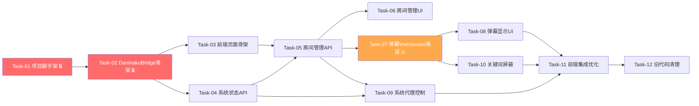

# 弹幕监听前端 — 开发任务计划

## 1. 任务概览

**总任务数**：12 个
**预计总工时**：690 分钟（约 11.5 小时）
**开发方法**：TDD — 每个任务按 RED → GREEN → REFACTOR 循环执行

**关键标注**：
- 🔒 阻塞任务：被多个任务依赖，建议优先完成
- ⚠️ 风险任务：技术难度高，可能需要额外时间

### 依赖关系图

### 可并行任务组

| 并行组 | 任务 | 说明 |
|--------|------|------|
| 1 | Task-03, Task-04 | 前端页面骨架和系统状态 API 互不依赖，可并行 |
| 2 | Task-06, Task-07 | 房间管理 UI 和弹幕 WebSocket 推送互不依赖，可并行 |
| 3 | Task-09, Task-10 | 系统代理控制和关键词屏蔽互不依赖，可并行 |

---

## 2. 开发任务

### 阶段一：基础设施

**阶段完成标准**：项目脚手架就绪，DanmakuBridge 可实例化，前端页面可访问

---

#### Task-01: 项目脚手架 🔒

**通俗解释**：创建前端服务的目录结构和基础文件，让项目有个可以跑起来的空壳

**做什么**：
1. 创建 `web/` 目录结构：`web/app.py`、`web/bridge.py`、`web/static/index.html`、`web/static/app.js`、`web/static/style.css`
2. 创建 `web/blocked_keywords.json`（空数组）
3. 创建 `web/__init__.py`
4. 在 `web/app.py` 中创建 aiohttp Application 骨架，配置 CORS，添加静态文件路由
5. 添加启动入口：`python -m web.app` 可启动服务

**涉及文件**：`web/app.py`、`web/__init__.py`、`web/static/index.html`、`web/static/app.js`、`web/static/style.css`、`web/blocked_keywords.json`

**参考**：技术方案 §2（架构概览）

**依赖**：无

**预估工时**：30 分钟

**验证标准**：
- [x] `python -m web.app` 启动不报错，监听在 `localhost:8765`
- [x] `GET http://localhost:8765/` 返回 200，内容为 HTML 页面
- [x] `GET http://localhost:8765/static/style.css` 返回 200
- [x] `GET http://localhost:8765/static/app.js` 返回 200
- [x] `web/blocked_keywords.json` 文件存在，内容为 `[]`

---

#### Task-02: DanmakuBridge 骨架 🔒

**通俗解释**：创建前后端桥接层的骨架，后续所有功能都通过它连接后端

**做什么**：
1. 创建 `web/bridge.py`，实现 `DanmakuBridge` 类骨架
2. 持有 `DanmakuListener` 实例
3. 实现 `add_room()`、`remove_room()`、`stop_all()` 方法骨架
4. 实现 `on_danmaku`、`on_error`、`on_reconnect`、`on_status_change` 回调注册
5. 实现 WebSocket 客户端管理：`add_ws_client()`、`remove_ws_client()`、`_broadcast()` 方法
6. 实现房间状态跟踪：`_rooms` 字典存储 `{room_key: {platform, room_id, status, engine_type}}`

**涉及文件**：`web/bridge.py`

**参考**：技术方案 §5.1（DanmakuBridge） → AC-001

**依赖**：Task-01

**预估工时**：60 分钟

**验证标准**：
- [x] `DanmakuBridge()` 可实例化，`_listener` 是 `DanmakuListener` 实例
- [x] `bridge._rooms` 初始为空字典 `{}`
- [x] `bridge._ws_clients` 初始为空集合 `set()`
- [x] `await bridge.add_ws_client(mock_ws)` → `mock_ws` 在 `bridge._ws_clients` 中
- [x] `await bridge.remove_ws_client(mock_ws)` → `mock_ws` 不在 `bridge._ws_clients` 中
- [x] `await bridge._broadcast({"type": "test"})` → 所有 ws_client 收到 `json.dumps({"type": "test"})`
- [x] `_broadcast` 时 ws_client 发送异常 → 该客户端被移除，不阻塞其他客户端

---

### 阶段二：页面加载与系统状态

**阶段完成标准**：用户打开前端页面，可以看到系统当前状态（后端连接状态、代理状态、房间列表）

---

#### Task-03: 前端页面骨架

**通俗解释**：创建一个简洁的单页面，有房间管理、弹幕显示、代理控制、关键词屏蔽四个区域

**做什么**：
1. 实现 `web/static/index.html` 页面结构：
   - 顶部：标题 + 系统状态指示灯
   - 左侧面板：房间列表 + 添加房间输入框 + 系统代理开关
   - 中间主区域：弹幕显示区
   - 右侧面板：关键词屏蔽区
2. 实现 `web/static/style.css` 样式：深色主题，参考旧 monitor.css 的配色
3. 实现 `web/static/app.js` 骨架：`DanmakuApp` class，WebSocket 连接逻辑，API 请求封装

**涉及文件**：`web/static/index.html`、`web/static/style.css`、`web/static/app.js`

**参考**：技术方案 §4.2（WebSocket 连接） → AC-001, AC-010

**依赖**：Task-02

**预估工时**：60 分钟

**验证标准**：
- [x] `GET /` 返回的 HTML 包含 `#room-list`、`#danmaku-container`、`#proxy-toggle`、`#keyword-list` 元素
- [x] 页面加载后 `DanmakuApp` class 实例化成功
- [x] WebSocket 连接到 `ws://localhost:8765/ws` → `app.ws` 不为 null
- [x] WebSocket 连接失败 → 页面显示"无法连接到后端服务"提示 → AC-010
- [x] WebSocket 断开后 3 秒内自动重连 → AC-012

---

#### Task-04: 系统状态 API

**通俗解释**：让前端能查询系统当前的整体状态——有几个房间在监听、代理是否开启等

**做什么**：
1. 在 `web/app.py` 中实现 `GET /api/status` 路由
2. 在 `web/app.py` 中实现 `GET /api/proxy/status` 路由
3. 在 `DanmakuBridge` 中实现 `get_status()` 方法，返回房间数、代理状态、关键词过滤状态
4. 在 `DanmakuBridge` 中实现 `get_proxy_status()` 方法，读取当前系统代理注册表状态

**涉及文件**：`web/app.py`、`web/bridge.py`

**参考**：技术方案 §4.1（GET /api/status）、§4.3（GET /api/proxy/status） → AC-001, AC-010

**依赖**：Task-02

**预估工时**：45 分钟

**验证标准**：
- [x] `GET /api/status` 返回 200，body 包含 `backend_connected: true`、`rooms_count: 0`、`proxy` 对象、`keyword_filter` 对象 → AC-001
- [x] `GET /api/proxy/status` 返回 200，body 包含 `enabled: false`（初始状态）→ AC-001
- [x] 系统代理已开启时，`GET /api/proxy/status` 返回 `enabled: true`、`host: "127.0.0.1"`、`port: 8827`
- [x] DanmakuBridge 添加房间后，`GET /api/status` 返回 `rooms_count: 1`

---

### 阶段三：房间管理

**阶段完成标准**：用户可以添加直播间、启动监听、停止监听、一键全部停止

---

#### Task-05: 房间管理 API

**通俗解释**：实现房间的增删查和启动停止接口，这是前端最核心的控制能力

**做什么**：
1. 实现 `GET /api/rooms` — 返回房间列表及状态
2. 实现 `POST /api/rooms` — 添加房间并启动监听
3. 实现 `DELETE /api/rooms/{platform}/{room_id}` — 停止并移除房间
4. 实现 `POST /api/rooms/stop-all` — 停止所有房间
5. 在 `DanmakuBridge.add_room()` 中集成 `DanmakuListener.start()`，处理格式校验、重复检查、ProxyStartError
6. 在 `DanmakuBridge.remove_room()` 中集成 `DanmakuListener.stop()`
7. 在 `DanmakuBridge.stop_all()` 中停止所有房间并恢复系统代理

**涉及文件**：`web/app.py`、`web/bridge.py`

**参考**：技术方案 §4.1（房间管理 API）、§5.1（DanmakuBridge） → AC-002, AC-003, AC-006, AC-008, AC-009, AC-013, AC-017

**依赖**：Task-04, Task-03

**预估工时**：90 分钟

**验证标准**：
- [x] `POST /api/rooms {"room": "douyin:123456"}` → 返回 200，`success: true`，`room.status == "running"` → AC-002, AC-003
- [x] `GET /api/rooms` → 返回包含刚添加的房间 → AC-002
- [x] `POST /api/rooms {"room": "abc"}` → 返回 400，`error` 包含 "Invalid room format" → AC-008
- [x] `POST /api/rooms {"room": "unknown:123"}` → 返回 400，`error` 包含 "Unsupported platform" → AC-008
- [x] `POST /api/rooms {"room": "douyin:123456"}` 两次 → 第二次返回 409，`error` 包含 "Room already exists" → AC-013
- [x] 房间已运行时 `POST /api/rooms {"room": "douyin:123456"}` → 返回 409（已存在，前端提示"已在监听中"）→ AC-009
- [x] `DELETE /api/rooms/douyin/123456` → 返回 200，`success: true` → AC-006
- [x] `POST /api/rooms/stop-all` → 所有房间停止，`success: true` → AC-006
- [x] `POST /api/rooms/stop-all` 后系统代理恢复为关闭 → BR-006
- [x] ProxyStartError（端口冲突）→ 返回 500，`error` 包含 "port" → AC-017
- [x] 添加 `douyin:111` + `douyin:222` → 两个房间共享同一 ProxyEngine 实例

---

#### Task-06: 房间管理 UI

**通俗解释**：让用户在页面上通过点击按钮来添加/删除房间、启停监听

**做什么**：
1. 实现房间列表渲染：每个房间显示平台标签、房间 ID、状态徽章、停止按钮
2. 实现添加房间表单：输入框 + 添加按钮，失焦时校验格式
3. 实现停止单个房间按钮
4. 实现全部停止按钮
5. 实现状态实时更新：通过 WebSocket 接收 status_change 消息更新房间状态

**涉及文件**：`web/static/app.js`、`web/static/style.css`

**参考**：技术方案 §4.1（房间管理 API） → AC-002, AC-003, AC-006, AC-008, AC-013

**依赖**：Task-05

**预估工时**：60 分钟

**验证标准**：
- [x] 输入 `douyin:123456` 点击添加 → 房间列表出现新条目，状态为"运行中" → AC-002, AC-003
- [x] 输入 `abc` 点击添加 → 输入框下方显示格式错误提示 → AC-008
- [x] 输入重复房间 → 显示"该房间已存在"提示 → AC-013
- [x] 点击房间停止按钮 → 状态变为"已停止" → AC-006
- [x] 点击全部停止 → 所有房间状态变为"已停止" → AC-006
- [x] 添加按钮在请求期间置灰，防止重复提交

---

### 阶段四：弹幕实时展示

**阶段完成标准**：用户启动监听后，弹幕实时显示在页面上

---

#### Task-07: 弹幕 WebSocket 推送 ⚠️

**通俗解释**：把后端拦截到的弹幕数据，通过 WebSocket 实时推送到前端页面

**做什么**：
1. 在 `DanmakuBridge` 中实现 `on_danmaku_handler()`：接收 DanmakuMessage，转换为前端格式，广播到所有 WS 客户端
2. 在 `DanmakuBridge` 中实现 `on_error_handler()`：接收异常，广播错误消息
3. 在 `DanmakuBridge` 中实现 `on_reconnect_handler()`：接收重连事件，广播重连状态
4. 在 `web/app.py` 中实现 `GET /ws` WebSocket 处理器：新连接时推送当前状态，断开时清理
5. 集成关键词过滤逻辑：在 `on_danmaku_handler()` 中检查关键词，仅对 `message_type == "normal"` 生效

**涉及文件**：`web/bridge.py`、`web/app.py`

**参考**：技术方案 §4.2（WebSocket 推送）、§5.2（关键词过滤）、§5.4（WebSocket 连接管理） → AC-005, AC-007, AC-012, AC-014, AC-015

**依赖**：Task-05

**预估工时**：90 分钟

**验证标准**：
- [x] DanmakuListener 收到 DanmakuMessage → 所有 WS 客户端收到 `{"type": "danmaku", "data": {...}}` 消息 → AC-005
- [x] 推送消息的 `data` 包含 `platform`、`room_id`、`user_name`、`content`、`timestamp`、`message_type` 字段 → AC-005
- [x] 礼物消息推送 `data.message_type == "gift"` 且包含 `gift_info` → AC-005
- [x] 关键词过滤启用时，`message_type == "normal"` 且 `content` 包含屏蔽词 → 不推送 → AC-007
- [x] 关键词过滤对 `message_type == "gift"` 不生效 → 礼物消息始终推送 → BR-005
- [x] 关键词过滤对 `message_type == "system"` 不生效 → 系统消息始终推送 → BR-005
- [x] WS 客户端连接时收到当前状态消息 `{"type": "status", ...}` → AC-001
- [x] 重连事件 → WS 客户端收到 `{"type": "reconnect", "data": {"room_id": ..., "status": "reconnecting"}}` → AC-012
- [x] 多房间弹幕按时间顺序推送（不按房间分组）→ AC-015

---

#### Task-08: 弹幕显示 UI

**通俗解释**：在页面上实时显示弹幕内容，让用户能看到监听效果

**做什么**：
1. 实现弹幕显示区域：每条弹幕显示用户名、内容、时间戳、平台标签
2. 弹幕按类型区分样式：普通弹幕、礼物消息（高亮）、系统消息（灰色）
3. 自动滚动到最新弹幕
4. 实现弹幕条目上限（500 条），超出时移除最旧的
5. 实现弹幕暂停/恢复滚动按钮

**涉及文件**：`web/static/app.js`、`web/static/style.css`

**参考**：技术方案 §4.2（WebSocket 推送消息格式） → AC-005, AC-014, AC-015

**依赖**：Task-07

**预估工时**：45 分钟

**验证标准**：
- [x] 收到 `{"type": "danmaku", "data": {...}}` → 弹幕区域出现新条目，显示用户名和内容 → AC-005
- [x] 普通弹幕样式与礼物弹幕样式不同（礼物高亮）
- [x] 系统消息样式为灰色
- [x] 弹幕区域自动滚动到底部
- [x] 超过 500 条时，最旧的弹幕被移除（DOM 节点数不超过 500）
- [x] 点击暂停按钮 → 弹幕继续接收但不自动滚动

---

### 阶段五：系统代理控制

**阶段完成标准**：用户可以在前端一键开启/关闭系统代理

---

#### Task-09: 系统代理控制

**通俗解释**：让用户在前端页面上直接控制 Windows 系统代理设置，不用手动去改注册表

**做什么**：
1. 实现 `POST /api/proxy/enable` — 调用 SystemProxyManager.register()
2. 实现 `POST /api/proxy/disable` — 调用 SystemProxyManager.close()
3. 在 `DanmakuBridge` 中实现 `enable_proxy()` 和 `disable_proxy()` 方法
4. 前端 UI：代理开关 Toggle 按钮，点击切换代理状态
5. 前端 UI：代理状态实时显示（已启用/已禁用 + 端口号）

**涉及文件**：`web/app.py`、`web/bridge.py`、`web/static/app.js`、`web/static/style.css`

**参考**：技术方案 §4.3（系统代理控制 API）、§5.3（系统代理控制逻辑） → AC-004, AC-011, AC-016

**依赖**：Task-04, Task-05

**预估工时**：60 分钟

**验证标准**：
- [x] `POST /api/proxy/enable` → 返回 200，`success: true`，`host: "127.0.0.1"`，`port: 8827` → AC-004
- [x] 开启代理后 Windows 注册表 `ProxyEnable == 1` → AC-004
- [x] `POST /api/proxy/disable` → 返回 200，`success: true` → AC-011
- [x] 关闭代理后 Windows 注册表 `ProxyEnable == 0` → AC-011
- [x] 权限不足时 `POST /api/proxy/enable` → 返回 500，`error` 包含 "permission" 或 "权限" → AC-016
- [x] 前端 Toggle 按钮点击开启 → 按钮变为"已启用"状态 → AC-004
- [x] 前端 Toggle 按钮点击关闭 → 按钮变为"已禁用"状态 → AC-011
- [x] 代理状态页面刷新后保持正确（读取注册表实际值）

---

### 阶段六：关键词屏蔽

**阶段完成标准**：用户可以添加/删除屏蔽关键词，弹幕实时过滤

---

#### Task-10: 关键词屏蔽

**通俗解释**：让用户可以设置屏蔽词，弹幕中包含这些词的消息不会显示

**做什么**：
1. 实现 `GET /api/keywords` — 返回关键词列表和启用状态
2. 实现 `POST /api/keywords` — 添加关键词
3. 实现 `DELETE /api/keywords/{keyword}` — 删除关键词
4. 实现 `PUT /api/keywords/toggle` — 开启/关闭过滤
5. 在 `DanmakuBridge` 中实现关键词持久化：加载/保存 `web/blocked_keywords.json`
6. 前端 UI：关键词列表 + 添加输入框 + 删除按钮 + 启用开关

**涉及文件**：`web/app.py`、`web/bridge.py`、`web/static/app.js`、`web/static/style.css`

**参考**：技术方案 §4.4（关键词屏蔽 API）、§5.2（关键词过滤逻辑） → AC-007, AC-018

**依赖**：Task-07

**预估工时**：60 分钟

**验证标准**：
- [x] `GET /api/keywords` → 返回 `{"keywords": [], "enabled": true}` → AC-007
- [x] `POST /api/keywords {"keyword": "广告"}` → 返回 `{"success": true, "keywords": ["广告"]}` → AC-007
- [x] `DELETE /api/keywords/广告` → 返回 `{"success": true, "keywords": []}` → AC-018
- [x] `PUT /api/keywords/toggle {"enabled": false}` → 返回 `{"success": true, "enabled": false}` → AC-018
- [x] 关键词持久化：添加后重启服务 → `GET /api/keywords` 仍返回之前的关键词
- [x] 关键词长度超过 50 字符 → 返回 400 错误
- [x] 重复添加同一关键词 → 不重复，返回已有列表
- [x] 前端添加关键词 → 列表出现新标签 → AC-007
- [x] 前端删除关键词 → 列表移除该标签 → AC-018
- [x] 前端关闭过滤开关 → 所有弹幕正常显示 → AC-018

---

### 阶段七：集成优化与清理

**阶段完成标准**：所有功能集成完毕，旧代码全部清理，系统可正常运行

---

#### Task-11: 前端集成优化

**通俗解释**：把所有功能串起来，确保页面整体体验流畅

**做什么**：
1. 集成所有功能到 `DanmakuApp` class：房间管理、弹幕显示、代理控制、关键词屏蔽
2. 实现页面加载时自动获取当前状态（房间列表、代理状态、关键词列表）
3. 实现错误提示统一处理：API 错误、WebSocket 断开
4. 实现弹幕延迟优化：减少不必要的 JSON 序列化/反序列化
5. 添加连接状态指示灯：实时显示 WebSocket 连接状态

**涉及文件**：`web/static/app.js`、`web/static/style.css`、`web/bridge.py`

**参考**：技术方案 §5.4（WebSocket 连接管理） → AC-010, AC-012, AC-014

**依赖**：Task-08, Task-09, Task-10

**预估工时**：60 分钟

**验证标准**：
- [x] 页面加载后自动显示当前房间列表、代理状态、关键词列表 → AC-001
- [x] WebSocket 断开 → 页面顶部显示"连接断开"红色指示灯 → AC-010, AC-012
- [x] WebSocket 重连成功 → 指示灯恢复绿色 → AC-012
- [x] API 请求失败 → 显示错误提示（Toast 或内联提示）
- [x] 弹幕从后端拦截到前端显示的延迟 < 1 秒（人工验证）→ AC-014

---

#### Task-12: 旧代码清理

**通俗解释**：把所有不再需要的旧文件删掉，让项目保持干净

**做什么**：
1. 删除根目录旧服务文件：`app.py`、`index.html`、`monitor.html`
2. 删除根目录旧管理器模块：`url_manager.py`、`monitor_manager.py`、`browser_manager.py`、`live_companion_client.py`、`douyin_barrage_parser.py`、`websocket_client.py`、`optimized_websocket_management.py`、`restart_config.py`、`chromium_restart_manager.py`、`monitor_connections.py`、`performance_optimizer.py`、`state_persistence_manager.py`、`script_config.py`
3. 删除根目录旧配置文件：`config.json`、`blocked_keywords.json`、`message_format_config.json`、`monitor_status.json`、`restart_config.json`、`script_config.json`、`live_urls.json`
4. 删除旧静态文件目录：`static/`（注意保留 `DouyinBarrageGrab/` 和 `直播监听脚本/`）
5. 验证 `danmaku_listener/` 包的所有测试仍然通过
6. 更新 `requirements.txt`：移除不再需要的依赖（如 `aiohttp-cors` 如果新前端不使用）

**涉及文件**：根目录多个文件（删除）

**参考**：技术方案 §5.5（旧代码清理范围）

**依赖**：Task-11

**预估工时**：30 分钟

**验证标准**：
- [x] `app.py` 不存在于项目根目录
- [x] `static/` 目录不存在于项目根目录
- [x] `config.json` 不存在于项目根目录
- [x] `danmaku_listener/` 包的所有测试通过（`pytest tests/ -v` 无失败）
- [x] `python -m web.app` 启动后所有功能正常（房间管理、弹幕展示、代理控制、关键词屏蔽）
- [x] 项目根目录下不再有旧的 `.py` 管理器文件

---

## 3. AC 覆盖总表

| AC 编号 | 验收标准概述 | 承接任务 | 验证方式 |
|---------|-------------|---------|---------|
| AC-001 | 前端页面加载与状态显示 | Task-03, Task-04 | 打开页面 → 显示系统状态 |
| AC-002 | 添加房间 | Task-05, Task-06 | 输入 douyin:123456 → 房间出现 |
| AC-003 | 启动房间监听 | Task-05, Task-06 | 点击启动 → 状态变为"运行中" |
| AC-004 | 开启系统代理 | Task-09 | 点击开启 → 注册表 ProxyEnable=1 |
| AC-005 | 弹幕实时显示 | Task-07, Task-08 | 弹幕出现在页面上 |
| AC-006 | 全部停止 | Task-05, Task-06 | 点击全部停止 → 所有房间停止 + 代理恢复 |
| AC-007 | 关键词屏蔽 | Task-07, Task-10 | 添加屏蔽词 → 包含该词的弹幕不显示 |
| AC-008 | 无效房间格式 | Task-05, Task-06 | 输入无效格式 → 错误提示 |
| AC-009 | 重复启动 | Task-05 | 已运行房间再次启动 → 忽略或提示 |
| AC-010 | 后端连接失败 | Task-03, Task-11 | 后端未启动 → 页面显示连接失败提示 |
| AC-011 | 关闭系统代理 | Task-09 | 点击关闭 → 注册表 ProxyEnable=0 |
| AC-012 | WebSocket 断线重连 | Task-03, Task-07, Task-11 | 断线 → 提示 + 3秒内自动重连 |
| AC-013 | 重复房间 ID | Task-05, Task-06 | 添加已存在房间 → 409 提示 |
| AC-014 | 弹幕延迟 < 1 秒 | Task-07, Task-11 | 人工验证弹幕实时性 |
| AC-015 | 多房间弹幕按时间排序 | Task-07, Task-08 | 多房间弹幕混合显示 |
| AC-016 | 代理设置权限错误 | Task-09 | 权限不足 → 错误提示 |
| AC-017 | 端口冲突处理 | Task-05 | 端口占用 → 错误提示 |
| AC-018 | 清空屏蔽关键词 | Task-10 | 清空列表 → 所有弹幕正常显示 |

---

## 4. 完成定义

- [x] 所有任务的验证标准（测试用例）通过
- [x] AC 覆盖总表中每条 AC 的验证方式已执行并通过
- [x] `python -m web.app` 一键启动前端服务，所有功能可用
- [x] `pytest tests/ -v` 全部通过（danmaku_listener 包测试无回归）
- [x] 旧代码全部清理，项目根目录不再有废弃文件
- [x] 手动端到端验证：启动服务 → 添加房间 → 开启代理 → 弹幕实时显示 → 停止监听 → 代理恢复