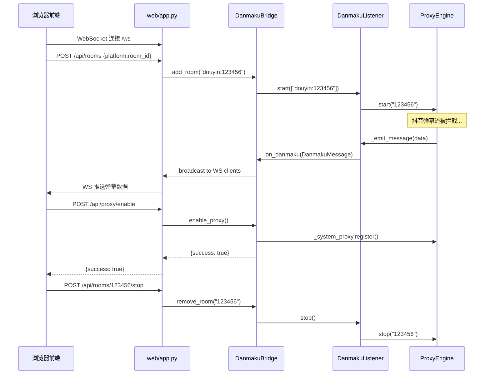

# 弹幕监听前端 — 技术设计文档

## 1. 设计概要

**功能描述**：一个轻量级 Web 前端服务，内嵌 danmaku_listener 后端，提供房间管理、弹幕实时展示、代理状态监控、关键词屏蔽和系统代理控制功能。

**影响范围**：
- 新增：`web/` 目录（前端服务代码）
- 删除：`app.py`、`index.html`、`monitor.html`、`static/`（旧前端全部清除）
- 删除：`url_manager.py`、`monitor_manager.py`、`browser_manager.py`、`live_companion_client.py`、`douyin_barrage_parser.py`、`websocket_client.py`、`optimized_websocket_management.py`、`restart_config.py`、`chromium_restart_manager.py`、`monitor_connections.py`、`performance_optimizer.py`、`state_persistence_manager.py`、`script_config.py`（旧后端辅助模块全部清除）
- 删除：`config.json`、`blocked_keywords.json`、`message_format_config.json`、`monitor_status.json`、`restart_config.json`、`script_config.json`、`live_urls.json`（旧配置文件，新系统使用 .env + Settings）
- 保留：`danmaku_listener/` 包（不受影响）、`DouyinBarrageGrab/`（参考用，保留）、`cookie/`（Cookie 存储，保留）、`protoc/`（Protobuf 工具，保留）、`tests/`（测试，保留）

**技术难点**：danmaku_listener 的 DanmakuListener 类是纯 async Python 包，没有内置 HTTP/WebSocket 服务能力，需要在前端服务层桥接 EventBus 事件到 WebSocket 推送

**外部依赖**：danmaku_listener 包（项目内部）

---

## 2. 架构概览

前端服务是一个独立的 aiohttp 应用，运行在同一进程中通过 import 直接调用 danmaku_listener。代码物理分离在 `web/` 目录下，不混入 `danmaku_listener/` 包。

```
┌─────────────────────────────────────────────┐
│                web/app.py                    │
│            (aiohttp Web 服务)                │
│                                              │
│  ┌──────────┐  ┌──────────┐  ┌───────────┐ │
│  │ HTTP API │  │ WS 弹幕  │  │ 静态文件  │ │
│  │  路由层  │  │ 推送层   │  │ 服务层    │ │
│  └────┬─────┘  └────┬─────┘  └───────────┘ │
│       │             │                        │
│  ┌────┴─────────────┴──────────────────┐    │
│  │        DanmakuBridge (桥接层)        │    │
│  │  - 持有 DanmakuListener 实例        │    │
│  │  - 注册 EventBus 回调               │    │
│  │  - 转发弹幕到 WebSocket 客户端      │    │
│  │  - 管理房间生命周期                  │    │
│  │  - 关键词过滤                        │    │
│  │  - 系统代理控制                      │    │
│  └────────────────┬────────────────────┘    │
│                   │                          │
└───────────────────┼──────────────────────────┘
                    │ import
        ┌───────────┴───────────┐
        │   danmaku_listener    │
        │   (Python 包)         │
        │  - DanmakuListener    │
        │  - EventBus           │
        │  - ProxyEngine        │
        │  - BrowserEngine      │
        │  - SystemProxyManager │
        └───────────────────────┘
```

### 关键数据流



---

## 3. 数据库设计

本项目不使用数据库。所有运行时状态保存在内存中（DanmakuBridge 实例属性），配置通过 `.env` 文件和 `danmaku_listener.config.Settings` 管理。关键词屏蔽列表保存在 `web/blocked_keywords.json` 文件中。

---

## 4. API 设计

### 4.1 房间管理

#### `GET /api/rooms`

**描述**：获取所有房间列表及状态 → AC-001

**Response（成功）**：
```json
{
  "rooms": [
    {
      "platform": "douyin",
      "room_id": "123456",
      "status": "running",
      "engine_type": "proxy"
    }
  ]
}
```

#### `POST /api/rooms`

**描述**：添加并启动房间监听 → AC-002, AC-003, AC-008, AC-009, AC-013

**Request**：
```json
{
  "room": "douyin:123456"
}
```

**Response（成功）**：
```json
{
  "success": true,
  "room": {
    "platform": "douyin",
    "room_id": "123456",
    "status": "running",
    "engine_type": "proxy"
  }
}
```

**异常响应**：

| 场景 | 状态码 | 响应 | 对应 AC |
|------|--------|------|---------|
| 格式不正确 | 400 | `{"success": false, "error": "Invalid room format, expected platform:room_id"}` | AC-008 |
| 平台不支持 | 400 | `{"success": false, "error": "Unsupported platform: xxx"}` | AC-008 |
| 房间已存在 | 409 | `{"success": false, "error": "Room already exists: douyin:123456"}` | AC-013 |
| 超过最大房间数 | 400 | `{"success": false, "error": "Maximum 10 rooms reached"}` | BR-002 |
| 房间已在运行 | 200 | `{"success": true, "room": {...}, "message": "Room already running"}` | AC-009 |
| 端口冲突 | 500 | `{"success": false, "error": "Proxy port 8827 is in use"}` | AC-017 |

#### `DELETE /api/rooms/{platform}/{room_id}`

**描述**：停止并移除房间监听 → AC-006

**Response（成功）**：
```json
{
  "success": true,
  "message": "Room douyin:123456 stopped and removed"
}
```

#### `POST /api/rooms/stop-all`

**描述**：停止所有房间监听并恢复系统代理 → AC-006, BR-006

**Response（成功）**：
```json
{
  "success": true,
  "message": "All rooms stopped, proxy restored"
}
```

### 4.2 弹幕推送

#### `GET /ws`

**描述**：WebSocket 连接，接收实时弹幕数据 → AC-005, AC-012, AC-014

**服务端推送消息格式**：

弹幕消息：
```json
{
  "type": "danmaku",
  "data": {
    "platform": "douyin",
    "room_id": "123456",
    "user_name": "测试用户",
    "content": "你好",
    "timestamp": 1722000000,
    "message_type": "normal"
  }
}
```

礼物消息：
```json
{
  "type": "danmaku",
  "data": {
    "platform": "douyin",
    "room_id": "123456",
    "user_name": "送礼者",
    "content": "送出了 火箭 x2",
    "timestamp": 1722000000,
    "message_type": "gift",
    "gift_info": {
      "gift_name": "火箭",
      "gift_count": 2,
      "gift_value": 100
    }
  }
}
```

系统消息（进房、点赞等）：
```json
{
  "type": "danmaku",
  "data": {
    "platform": "douyin",
    "room_id": "123456",
    "user_name": "用户A",
    "content": "进入了直播间",
    "timestamp": 1722000000,
    "message_type": "system"
  }
}
```

连接状态消息：
```json
{
  "type": "status",
  "data": {
    "connected": true,
    "rooms_count": 2
  }
}
```

断线重连消息：
```json
{
  "type": "reconnect",
  "data": {
    "room_id": "123456",
    "status": "reconnecting"
  }
}
```

### 4.3 系统代理控制

#### `GET /api/proxy/status`

**描述**：获取系统代理当前状态 → AC-001, AC-004

**Response（成功）**：
```json
{
  "enabled": true,
  "host": "127.0.0.1",
  "port": 8827
}
```

#### `POST /api/proxy/enable`

**描述**：开启系统代理 → AC-004, AC-016

**Response（成功）**：
```json
{
  "success": true,
  "host": "127.0.0.1",
  "port": 8827
}
```

**异常响应**：

| 场景 | 状态码 | 响应 | 对应 AC |
|------|--------|------|---------|
| 权限不足 | 500 | `{"success": false, "error": "Failed to set system proxy, check permissions"}` | AC-016 |

#### `POST /api/proxy/disable`

**描述**：关闭系统代理 → AC-011

**Response（成功）**：
```json
{
  "success": true,
  "message": "System proxy disabled"
}
```

### 4.4 关键词屏蔽

#### `GET /api/keywords`

**描述**：获取屏蔽关键词列表 → AC-007

**Response（成功）**：
```json
{
  "keywords": ["广告", "代练"],
  "enabled": true
}
```

#### `POST /api/keywords`

**描述**：添加屏蔽关键词 → AC-007

**Request**：
```json
{
  "keyword": "广告"
}
```

**Response（成功）**：
```json
{
  "success": true,
  "keywords": ["广告", "代练"]
}
```

#### `DELETE /api/keywords/{keyword}`

**描述**：移除屏蔽关键词 → AC-018

**Response（成功）**：
```json
{
  "success": true,
  "keywords": ["代练"]
}
```

#### `PUT /api/keywords/toggle`

**描述**：开启/关闭关键词过滤功能 → AC-018

**Request**：
```json
{
  "enabled": true
}
```

**Response（成功）**：
```json
{
  "success": true,
  "enabled": true
}
```

### 4.5 系统状态

#### `GET /api/status`

**描述**：获取系统整体状态 → AC-001, AC-010

**Response（成功）**：
```json
{
  "backend_connected": true,
  "rooms_count": 2,
  "proxy": {
    "enabled": true,
    "host": "127.0.0.1",
    "port": 8827
  },
  "keyword_filter": {
    "enabled": true,
    "count": 2
  }
}
```

---

## 5. 核心逻辑

### 5.1 DanmakuBridge — 前后端桥接层

DanmakuBridge 是前端服务的核心组件，持有 DanmakuListener 实例并桥接 EventBus 事件到 WebSocket 客户端。

**职责**：
- 管理 DanmakuListener 生命周期
- 注册 on_danmaku / on_error / on_reconnect / on_status_change 回调
- 将 DanmakuMessage 转换为前端 WebSocket 推送格式
- 关键词过滤（仅对 message_type=normal 的弹幕生效 → BR-005）
- 系统代理控制（通过 ProxyEngine 的 _system_proxy）

**关键实现**：

```python
class DanmakuBridge:
    def __init__(self):
        self._listener = DanmakuListener()
        self._ws_clients: Set[web.WebSocketResponse] = set()
        self._blocked_keywords: List[str] = []
        self._keyword_filter_enabled: bool = True
        self._load_blocked_keywords()
        self._setup_callbacks()

    async def add_room(self, room_spec: str) -> dict:
        """添加房间 → AC-002, AC-003"""
        # 解析格式
        spec = parse_room_spec(room_spec)
        # 检查重复 → AC-013
        if spec.room_id in self._running_rooms:
            return {"success": True, "message": "Room already running"}
        # 启动监听
        await self._listener.start([room_spec])
        return {"success": True, "room": {...}}

    async def on_danmaku_handler(self, msg: DanmakuMessage):
        """弹幕回调 → AC-005, AC-007, AC-014"""
        # 关键词过滤（仅普通弹幕）→ BR-005
        if self._keyword_filter_enabled and msg.message_type == "normal":
            if any(kw in msg.content for kw in self._blocked_keywords):
                return
        # 转换为前端格式并推送
        await self._broadcast({"type": "danmaku", "data": msg.to_dict()})

    async def _broadcast(self, message: dict):
        """广播消息到所有 WebSocket 客户端"""
        msg_str = json.dumps(message, ensure_ascii=False)
        dead_clients = set()
        for client in self._ws_clients:
            try:
                await client.send_str(msg_str)
            except Exception:
                dead_clients.add(client)
        self._ws_clients -= dead_clients
```

### 5.2 关键词过滤逻辑 → AC-007, AC-018, BR-005

**过滤规则**：
- 仅对 `message_type == "normal"` 的弹幕生效
- `message_type == "gift"` 和 `message_type == "system"` 的消息不受关键词过滤影响
- 过滤在 DanmakuBridge 层执行，不修改 danmaku_listener 包的代码
- 关键词列表持久化到 `web/blocked_keywords.json`

### 5.3 系统代理控制 → AC-004, AC-011, AC-016, BR-004

**实现方式**：
- 通过 ProxyEngine 实例的 `_system_proxy`（SystemProxyManager）控制
- 开启代理时：调用 `register(proxy_host, proxy_port)`
- 关闭代理时：调用 `close()`
- 代理状态检测：读取 Windows 注册表 `ProxyEnable` 值
- 端口固定为 Settings 中配置的 `proxy_port`（默认 8827）→ BR-004

**注意事项**：
- 系统代理与房间监听解耦：可以独立开启/关闭系统代理
- 如果 ProxyEngine 尚未启动，开启系统代理时需要先获取 SystemProxyManager 实例
- 停止所有房间时自动恢复系统代理 → BR-006

### 5.4 WebSocket 连接管理 → AC-005, AC-010, AC-012, AC-014

**连接管理**：
- 使用 aiohttp WebSocket 原生支持
- 新客户端连接时推送当前状态（房间列表、代理状态、关键词列表）
- 客户端断开时从广播列表中移除

**断线重连（前端侧）→ AC-012**：
- 前端 JavaScript 实现：WebSocket 断开后 3 秒自动重连
- 重连成功后重新获取当前状态

**弹幕延迟控制 → AC-014, BR-003**：
- DanmakuBridge 的 on_danmaku 回调直接广播，不经中间队列
- 单订阅者场景下 EventBus 直接 await 调用，无 gather 开销
- WebSocket 发送使用 `send_str` 非阻塞写入

### 5.5 旧代码清理范围

**删除的文件**（根目录下）：
- `app.py` — 旧单体服务，被 `web/app.py` 替代
- `index.html` — 旧重定向页面，被 `web/static/index.html` 替代
- `monitor.html` — 旧监控页面，被 `web/static/index.html` 替代
- `url_manager.py` — 旧 URL 管理，房间管理移入 DanmakuBridge
- `monitor_manager.py` — 旧监控状态管理，状态由 DanmakuListener 管理
- `browser_manager.py` — 旧浏览器管理，由 BrowserEngine 替代
- `live_companion_client.py` — 旧直播伴侣客户端，由代理模式替代
- `douyin_barrage_parser.py` — 旧消息解析，由 DouyinAdapter 替代
- `websocket_client.py` — 旧 WS 客户端，不再需要
- `optimized_websocket_management.py` — 旧 WS 管理，由 DanmakuBridge 简化实现
- `restart_config.py` — 旧重启配置，不再需要
- `chromium_restart_manager.py` — 旧 Chromium 重启，不再需要
- `monitor_connections.py` — 旧监控连接，不再需要
- `performance_optimizer.py` — 旧性能优化，不再需要
- `state_persistence_manager.py` — 旧状态持久化，不再需要
- `script_config.py` — 旧脚本配置，不再需要
- `config.json` — 旧配置文件，由 .env + Settings 替代
- `blocked_keywords.json` — 旧关键词文件，由 `web/blocked_keywords.json` 替代
- `message_format_config.json` — 旧消息格式配置，由 DanmakuMessage 标准格式替代
- `monitor_status.json` — 旧监控状态，不再需要
- `restart_config.json` — 旧重启配置，不再需要
- `script_config.json` — 旧脚本配置，不再需要
- `live_urls.json` — 旧 URL 列表，不再需要
- `static/` 目录 — 旧静态文件，由 `web/static/` 替代

---

## 6. 现有代码改动

| 模块 / 文件 | 改动内容 | 原因 | 对应 AC |
|-------------|---------|------|---------|
| `danmaku_listener/listener.py` | 无改动 | 前端通过 import 使用，不需要修改包代码 | — |
| `danmaku_listener/engines/proxy_engine.py` | 无改动 | 系统代理控制通过 `_system_proxy` 属性访问 | AC-004, AC-011 |
| `danmaku_listener/managers/system_proxy_manager.py` | 无改动 | 直接复用现有 register/close 方法 | AC-016 |
| `danmaku_listener/config/settings.py` | 无改动 | 通过 get_settings() 读取配置 | — |
| 根目录旧文件 | 删除（见 5.5 节完整列表） | 已被新架构替代，代码已弃用 | — |

---

## 7. 技术决策

### 7.1 前端服务内嵌 DanmakuListener vs 分离部署

**背景**：需要决定前端 Web 服务与 danmaku_listener 后端的部署关系。

**选项**：
- A: 前端服务内嵌 DanmakuListener（同一进程，import 调用）— 部署简单，一个命令启动，零网络延迟
- B: 前端服务 + 后端 API 服务分离（两个进程，HTTP/WS 通信）— 真正前后端解耦，后端可独立重启

**结论**：选择 A。核心理由：这是一个开发测试工具，部署便利性优先；danmaku_listener 保持包的纯净性（代码在 `web/` 目录），后续集成到直播系统时直接 import 包即可。

### 7.2 前端技术选型：纯 HTML/JS vs 框架

**背景**：需要决定前端页面的实现方式。

**选项**：
- A: 纯 HTML + Vanilla JS — 无构建步骤，零依赖，直接编辑即可
- B: Vue/React SFC — 组件化开发，但需要 Node.js 构建链

**结论**：选择 A。核心理由：功能简单（5 个功能模块），不需要框架的复杂度；项目没有 Node.js 构建链，保持纯 Python 技术栈的一致性；参考旧前端的 `script.js` 模式，用 ES6 class 封装即可。

### 7.3 WebSocket 广播机制：自实现 vs 复用 OptimizedWebSocketManager

**背景**：旧代码有 `OptimizedWebSocketManager`，新前端需要 WebSocket 广播能力。

**选项**：
- A: 在 DanmakuBridge 中自实现简易广播 — 代码量小，逻辑清晰，无多余功能
- B: 复用旧 OptimizedWebSocketManager — 功能完整（批处理、死连接清理、统计）

**结论**：选择 A。核心理由：旧 OptimizedWebSocketManager 与 aiohttp API 深度耦合，且功能远超需求；新前端只需简单的广播 + 死连接清理，50 行代码即可实现；避免引入旧代码的技术债务。

---

## 8. 安全与性能

**输入校验**：
- 房间格式通过 `parse_room_spec()` 校验（复用 danmaku_listener 的现有逻辑）
- 关键词长度限制 50 字符，防止超长输入
- API 参数类型校验（aiohttp 自动处理 JSON 解析异常）

**性能考量**：
- WebSocket 广播使用 `send_str` 非阻塞写入，避免慢客户端拖累整体 → AC-014
- 关键词过滤使用 `any()` + `in` 运算符，O(n*m) 但 n 和 m 都很小（关键词 < 100，弹幕内容 < 500 字符）
- 前端弹幕显示区域使用虚拟滚动或最大条目限制（如 500 条），防止 DOM 节点无限增长

---

## 9. AC 覆盖总表

| AC 编号 | 验收标准概述 | 实现位置 |
|---------|-------------|---------|
| AC-001 | 前端页面加载与状态显示 | `web/static/index.html` + `GET /api/status` + `GET /api/proxy/status` |
| AC-002 | 添加房间 | `POST /api/rooms` + `DanmakuBridge.add_room()` |
| AC-003 | 启动房间监听 | `POST /api/rooms` → `DanmakuListener.start()` |
| AC-004 | 开启系统代理 | `POST /api/proxy/enable` → `SystemProxyManager.register()` |
| AC-005 | 弹幕实时显示 | `GET /ws` + `DanmakuBridge.on_danmaku_handler()` + `_broadcast()` |
| AC-006 | 全部停止 | `POST /api/rooms/stop-all` → `DanmakuListener.stop()` + `SystemProxyManager.close()` |
| AC-007 | 关键词屏蔽 | `POST /api/keywords` + `DanmakuBridge` 过滤逻辑 |
| AC-008 | 无效房间格式 | `POST /api/rooms` 参数校验 + `parse_room_spec()` |
| AC-009 | 重复启动 | `DanmakuBridge.add_room()` 重复检查 |
| AC-010 | 后端连接失败 | 前端 JS WebSocket 重连逻辑 |
| AC-011 | 关闭系统代理 | `POST /api/proxy/disable` → `SystemProxyManager.close()` |
| AC-012 | WebSocket 断线重连 | 前端 JS 自动重连 + 后端 `on_reconnect` 回调 |
| AC-013 | 重复房间 ID | `POST /api/rooms` 409 响应 |
| AC-014 | 弹幕延迟 < 1 秒 | EventBus 直调 + WebSocket `send_str` 非阻塞 |
| AC-015 | 多房间弹幕按时间排序 | `DanmakuBridge._broadcast()` 统一推送，前端按时间戳排序 |
| AC-016 | 代理设置权限错误 | `POST /api/proxy/enable` 异常捕获 + 错误响应 |
| AC-017 | 端口冲突处理 | `POST /api/rooms` ProxyStartError 捕获 + 错误响应 |
| AC-018 | 清空屏蔽关键词 | `DELETE /api/keywords/{keyword}` + `PUT /api/keywords/toggle` |

---

## 附录：变更记录

| 日期 | 变更内容 | 原因 |
|------|---------|------|
| 2026-07-27 | 初始版本 | — |